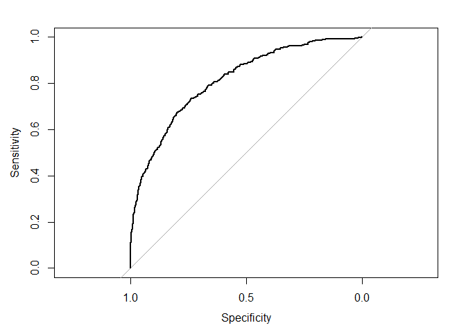
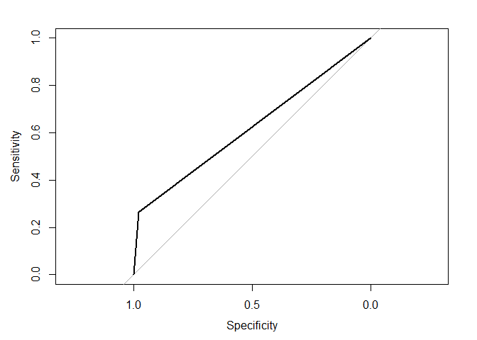

Modelamiento paramétrico
================

Para comparar modelos parametricos con no-parametricos, utilizaremos la
data de Churn, que significa la tasa de “fuga de clientes” de un banco
en particular.

Cargamos los datos y los exploramos

``` r
library(tidyverse)

data <- read_csv("Churn_Modelling.csv")

data %>% glimpse()
```

    ## Rows: 10,000
    ## Columns: 14
    ## $ RowNumber       <dbl> 1, 2, 3, 4, 5, 6, 7, 8, 9, 10, 11, 12, 13, 14, 15, 16,~
    ## $ CustomerId      <dbl> 15634602, 15647311, 15619304, 15701354, 15737888, 1557~
    ## $ Surname         <chr> "Hargrave", "Hill", "Onio", "Boni", "Mitchell", "Chu",~
    ## $ CreditScore     <dbl> 619, 608, 502, 699, 850, 645, 822, 376, 501, 684, 528,~
    ## $ Geography       <chr> "France", "Spain", "France", "France", "Spain", "Spain~
    ## $ Gender          <chr> "Female", "Female", "Female", "Female", "Female", "Mal~
    ## $ Age             <dbl> 42, 41, 42, 39, 43, 44, 50, 29, 44, 27, 31, 24, 34, 25~
    ## $ Tenure          <dbl> 2, 1, 8, 1, 2, 8, 7, 4, 4, 2, 6, 3, 10, 5, 7, 3, 1, 9,~
    ## $ Balance         <dbl> 0.00, 83807.86, 159660.80, 0.00, 125510.82, 113755.78,~
    ## $ NumOfProducts   <dbl> 1, 1, 3, 2, 1, 2, 2, 4, 2, 1, 2, 2, 2, 2, 2, 2, 1, 2, ~
    ## $ HasCrCard       <dbl> 1, 0, 1, 0, 1, 1, 1, 1, 0, 1, 0, 1, 1, 0, 1, 0, 1, 1, ~
    ## $ IsActiveMember  <dbl> 1, 1, 0, 0, 1, 0, 1, 0, 1, 1, 0, 0, 0, 0, 1, 1, 0, 1, ~
    ## $ EstimatedSalary <dbl> 101348.88, 112542.58, 113931.57, 93826.63, 79084.10, 1~
    ## $ Exited          <dbl> 1, 0, 1, 0, 0, 1, 0, 1, 0, 0, 0, 0, 0, 0, 0, 0, 1, 0, ~

Vemos que la data contiene 14 columnas y 10 mil observaciones. Hay 3
variables que son categoricas, Apellido, Geografia y Genero. Tenure mide
el numero de años que un cliente lleva en el banco.

Antes de aplicar algun modelo de ML vamos a separar la data en conjunto
de entrenamiento y conjunto de pruebas. Tambien vamos a quitar la
columna RowNumber, y las variables que no son numericas. En el caso de
Gender la transformaremos a numerica

``` r
data$RowNumber <- NULL

data$Surname <- NULL
data$Geography <- NULL

data$is_female <- (data$Gender == "Female") %>% as.numeric()
data$Gender <- NULL


set.seed(42)
sample <- sample(1:nrow(data), .8*10000)

trainData <- data[sample,]
testData <- data[-sample,]
```

Para implementar el modelo Naive Bayes vamos a utilizar la libreria
e1071, que tiene implementado este metodo.

``` r
library(e1071)

modeloNB <- naiveBayes(Exited ~ ., data = trainData)
pred <- predict(modeloNB, testData, type ="raw")

modeloNB
```

    ## 
    ## Naive Bayes Classifier for Discrete Predictors
    ## 
    ## Call:
    ## naiveBayes.default(x = X, y = Y, laplace = laplace)
    ## 
    ## A-priori probabilities:
    ## Y
    ##        0        1 
    ## 0.797625 0.202375 
    ## 
    ## Conditional probabilities:
    ##    CustomerId
    ## Y       [,1]     [,2]
    ##   0 15690685 71708.84
    ##   1 15689497 72749.42
    ## 
    ##    CreditScore
    ## Y       [,1]      [,2]
    ##   0 651.7514  95.67711
    ##   1 645.3718 100.73046
    ## 
    ##    Age
    ## Y       [,1]      [,2]
    ##   0 37.53659 10.213479
    ##   1 44.89809  9.595148
    ## 
    ##    Tenure
    ## Y       [,1]     [,2]
    ##   0 5.012537 2.873263
    ##   1 4.993206 2.939956
    ## 
    ##    Balance
    ## Y       [,1]     [,2]
    ##   0 73211.16 63001.48
    ##   1 91226.49 58587.33
    ## 
    ##    NumOfProducts
    ## Y       [,1]      [,2]
    ##   0 1.542862 0.5093987
    ##   1 1.470661 0.8014805
    ## 
    ##    HasCrCard
    ## Y        [,1]      [,2]
    ##   0 0.7049052 0.4561211
    ##   1 0.6930204 0.4613834
    ## 
    ##    IsActiveMember
    ## Y        [,1]      [,2]
    ##   0 0.5552421 0.4969779
    ##   1 0.3545398 0.4785214
    ## 
    ##    EstimatedSalary
    ## Y        [,1]     [,2]
    ##   0  99461.07 57368.00
    ##   1 101449.27 57901.86
    ## 
    ##    is_female
    ## Y        [,1]      [,2]
    ##   0 0.4275192 0.4947574
    ##   1 0.5497221 0.4976753

Calculamos el AUC para evaluar la capacidad del modelo de predecir. Este
indice varia entre 0.5 y 1, donde 1 es mejor.

``` r
library(pROC)
```

    ## Warning: package 'pROC' was built under R version 4.0.4

    ## Type 'citation("pROC")' for a citation.

    ## 
    ## Attaching package: 'pROC'

    ## The following objects are masked from 'package:stats':
    ## 
    ##     cov, smooth, var

``` r
testData$prob <- pred[,2]

curva_roc <- roc(Exited ~ prob, data = testData)
```

    ## Setting levels: control = 0, case = 1

    ## Setting direction: controls < cases

``` r
plot(curva_roc)    
```

<!-- -->

``` r
auc(curva_roc)
```

    ## Area under the curve: 0.8105

Ahora probaremos con un modelo no-parametrico, en este caso el modelo
knn. Este modelo viene implementado en la libreria class. Antes de
implementarlo debemos escalar la data utilizando la funcion scale.

``` r
library(class)

testData$prob <- NULL

clasetrain <- factor(trainData$Exited)
clasetest <- factor(testData$Exited)

trainData <-  scale(trainData) %>% data.frame()
testData <- scale(testData) %>% data.frame()

modeloknn <- knn(trainData[,-10], testData[,-10], cl = clasetrain, k = 15, prob = TRUE)

testData$prob <- modeloknn %>% as.character() %>% as.numeric()

testData$Exited <- clasetest %>% as.character() %>% as.numeric()

curva_roc <- roc(Exited ~ prob, data = testData)
```

    ## Setting levels: control = 0, case = 1

    ## Setting direction: controls < cases

``` r
plot(curva_roc)    
```

<!-- -->

``` r
auc(curva_roc)
```

    ## Area under the curve: 0.6208

Vemos el el AUC del modelo KNN en esta ocasion esta por debajo del
modelo parametrico Naive Bayes.
