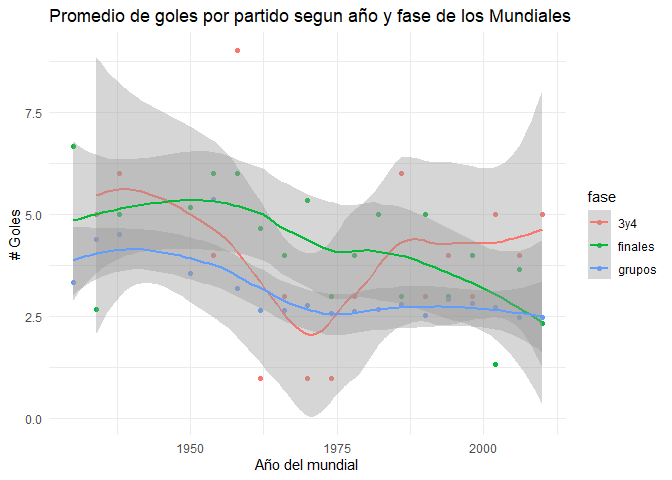

Clase 1: Introduccion al análisis de datos
================

En este ejemplo vamos a analizar el desempeño de los equipos de futbol a
lo largo de los mundiales.

El proceso de mineria de datos comienza por conseguir la data. En el
siguiente codigo cargamos un archivo csv que se encuentra en el sitio
dataminingsoccer.com

``` r
#    aca estoy leyendo una tabla csv que se encuentra publica en internet, y viene separada por ";" y con encabezados
Mundiales = read.table("http://dataminingsoccer.com/de/wp-content/downloads/SoccerDataAllWorldCups.csv", sep=";",header=T)


#  con esta linea de codigo inspeccionamos la data, cada fila en la data representa un partido
head(Mundiales) 
```

    ##                        content...source year
    ## 1              www.DataMiningSoccer.com 1930
    ## 2           Football Result Predictions 1930
    ## 3              www.DataMiningSoccer.com 1930
    ## 4         Fussball Ergebnis Vorhersagen 1930
    ## 5              www.DataMiningSoccer.com 1930
    ## 6 Predicciones de Resultados de Fútbol 1930
    ##   country.where.wc..world.championship..took.place which.stage.of.the.turnament
    ## 1                                          Uruguay                        group
    ## 2                                          Uruguay                        group
    ## 3                                          Uruguay                        group
    ## 4                                          Uruguay                        group
    ## 5                                          Uruguay                        group
    ## 6                                          Uruguay                        group
    ##          date country.team.A country.team.B score.A score.B
    ## 1 13-Jul-1930         France         Mexico       4       1
    ## 2 15-Jul-1930      Argentina         France       1       0
    ## 3 16-Jul-1930          Chile         Mexico       3       0
    ## 4 19-Jul-1930          Chile         France       1       0
    ## 5 19-Jul-1930      Argentina         Mexico       6       3
    ## 6 22-Jul-1930      Argentina          Chile       3       1

## Generacion de variables

En este ejemplo digamos que queremos analizar la cantidad de goles por
partido a lo largo de la historia del Futbol. Para esto, debemos sumar
los goles de ambos equipos en cada partido.

``` r
#    creamos una variable con los goles por partido
Mundiales$goles_partido = Mundiales$score.A + Mundiales$score.B

hist(Mundiales$goles_partido)
```

<!-- --> Nuestra
experiencia nos dice que la cantidad de goles deberia variar segun la
etapa del torneo. Antes de analizar esto, vamos a ver si las etapas del
torneo son homologables a lo largo de los torneos.

``` r
#    veo si las etapas del torneo son consistentes
table(Mundiales$which.stage.of.the.turnament)
```

    ## 
    ##                 final           final round           first round 
    ##                    18                     6                    16 
    ##                 group              play off         quarter final 
    ##                   527                     5                    60 
    ##                replay           round of 16  second round group a 
    ##                     4                    64                     9 
    ## second round group a   second round group b  second round group c 
    ##                     6                    15                     3 
    ##  second round group d            semi final     third place match 
    ##                     3                    32                    17

No son todas consistentes, por lo que crearemos otra variable que
representara una simplificacion de la fase. Definiremos 2 fases
simplificadas, fases de avance y fases finales. Aquellas fases que
contengan la palabra “final” pertenecen al segundo grupo, y el resto al
primero

``` r
# iniciamos la variable con el valor "grupos" para todos los partidos
Mundiales$fase = "grupos"

#    luego cambiamos aquellas fases que contengan la palabra "final" (final, semi final y final round)
Mundiales$fase[grep("^final|^semi final|^final round",Mundiales$which.stage.of.the.turnament)] = "finales"

#    y finalmente cambiamos aquellas fases que contengan la palabra "third" por 3y4
Mundiales$fase[grep("third",Mundiales$which.stage.of.the.turnament)] = "3y4"

table(Mundiales$fase)
```

    ## 
    ##     3y4 finales  grupos 
    ##      17      56     712

Ya que queremos analizar la evolucion de goles por fase a lo largo de la
historia, debemos promediar los goles para cada fase / mundial.

``` r
data_fase = aggregate(goles_partido ~ year+fase, Mundiales, mean)

head(data_fase)
```

    ##   year fase goles_partido
    ## 1 1934  3y4             5
    ## 2 1938  3y4             6
    ## 3 1954  3y4             4
    ## 4 1958  3y4             9
    ## 5 1962  3y4             1
    ## 6 1966  3y4             3

Finalmente visualizamos la tabla resultante

<!-- -->
