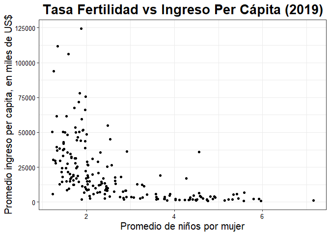
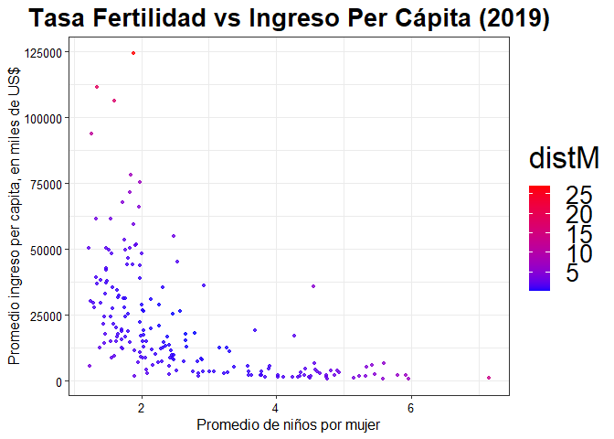
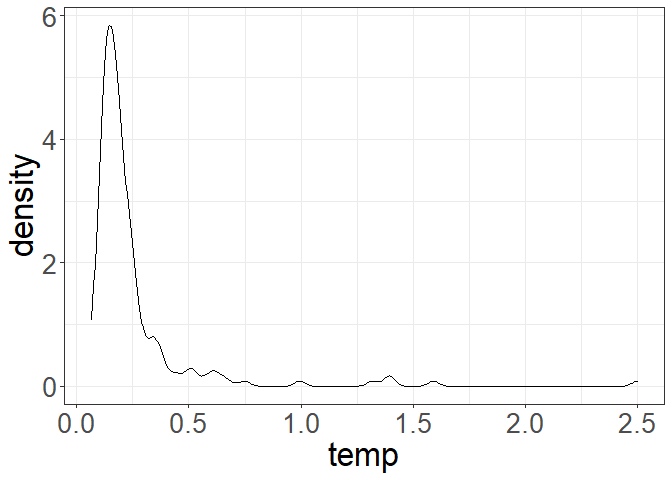
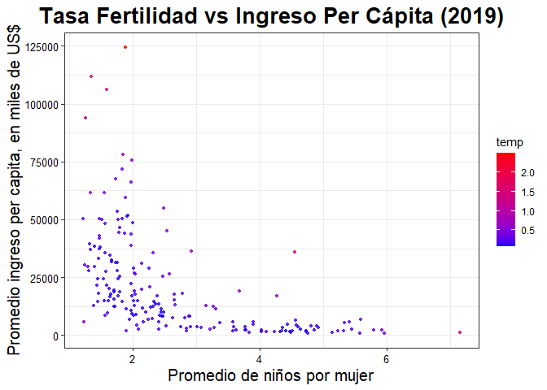
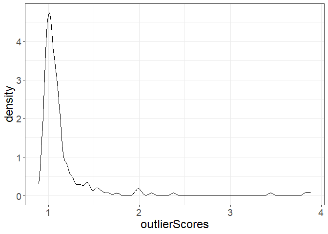
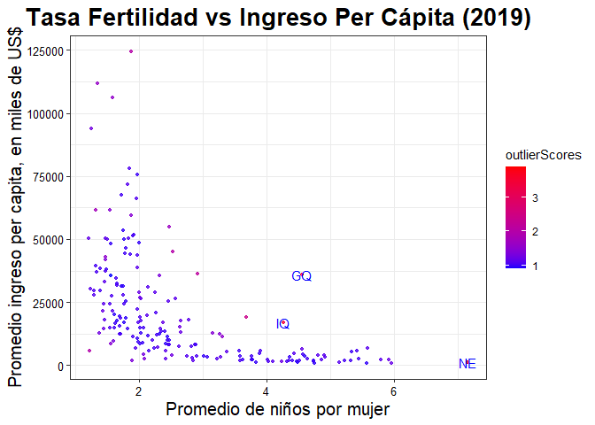

Datos atipicos
================

Para analizar casos atipicos, vamos a utilizar un dataset con las tasas
de fertilidad por pais, dataset que cuenta con otros campos como el
ingreso per capita

``` r
# cargamos datos disponibles en la misma carpeta
data <- read.csv("tasaFertilidad2019vsGPD.csv")

# echamos un vistazo a la data
data %>% glimpse()
```

    ## Rows: 189
    ## Columns: 5
    ## $ Pais             <chr> "Afghanistan", "Albania", "Algeria", "Angola", "An...
    ## $ Abrev            <chr> "AF", "AL", "DZ", "AO", "AG", "AR", "AM", "AW", "A...
    ## $ Continente       <chr> "Asia", "Europe", "Africa", "Africa", "North Ameri...
    ## $ TasaFertilidad   <dbl> 4.412, 1.705, 2.650, 5.589, 2.034, 2.268, 1.601, 1...
    ## $ IngresoPerCapita <int> 2000, 12500, 15200, 6800, 26300, 20900, 9500, 2530...

## Inspeccion visual

El primer metodo que programaremos es el de inspeccion visual, para el
cual utilizaremos la libreria ggplot

<!-- -->

En el gráfico se pueden divisar anomalías, pero es un metodo subjetivo y
dependiente de cada analista.

## Prueba univariada de Grubb

Para utilizar un metodo analitico, aplicaremos el test de Grubb, el cual
viene implementado en la libreria outliers

``` r
# invocamos la libreria
library(outliers)

# calculo el test de grub sobre la variable IngresoPerCapita
dataOutlier <- grubbs.test(data$IngresoPerCapita, two.sided=F)
dataOutlier
```

    ## 
    ##  Grubbs test for one outlier
    ## 
    ## data:  data$IngresoPerCapita
    ## G = 4.68872, U = 0.88244, p-value = 0.0001293
    ## alternative hypothesis: highest value 124500 is an outlier

``` r
# calculo el test de grub sobre la variable TasaFertilidad
dataOutlier <- grubbs.test(data$TasaFertilidad, two.sided=F)
dataOutlier
```

    ## 
    ##  Grubbs test for one outlier
    ## 
    ## data:  data$TasaFertilidad
    ## G = 3.50732, U = 0.93422, p-value = 0.03473
    ## alternative hypothesis: highest value 7.153 is an outlier

Este metodo tiene la limitante que hay que predefinir el numero de datos
atipicos a revisar, en este caso, valida que los datos maximos de ambas
variables tienen comportamiento atipico.

## Metodos de distancia

Una alternativa multivariada a la deteccion de casos atipicos es el
metodo de las distancias. Calcularemos la distancia de Mahalanobis para
contemplar las covarianzas presentes en la data.

``` r
# calculo las distancias utilizando la funcion mahalanobis, disponible en R base
distM <- mahalanobis(data[,c(4,5)],colMeans(data[,c(4,5)]),cov(data[,c(4,5)]))
 
# Visualizo la distribucion de las distancias
ggplot(distM %>% as_tibble(), aes(x=distM)) +
  geom_density() +
  theme_bw() + 
  theme(text=element_text(size=25))
```

<!-- -->

``` r
# Visualizo tambien el grafico de dispersion
ggplot(data, aes(x = TasaFertilidad, y = IngresoPerCapita, color = distM)) +
  scale_color_gradient(low="blue", high="red") +
  geom_point(size=1, alpha=0.8) +
  ggtitle("Tasa Fertilidad vs Ingreso Per Cápita (2019)") + 
  xlab("Promedio de niños por mujer") + 
  ylab("Promedio ingreso per capita, en miles de US$") + 
  theme_bw() +
  theme(axis.title = element_text(size = 12),
        axis.text = element_text(size = 10, color="black"),
        text=element_text(size=25),
        plot.title = element_text(size = 20, face="bold", hjust=0.5))
```

<!-- -->

Se puede ver que aquellos puntos mas alejados de la nube central tienen
los mayores valores de distancia, que se puede ver de color rojo

## Metodo de vecinos mas cercanos

Este metodo se basa en identificar los vecinos con menor distancia a
cada punto, por lo que se puede utilizar la misma distancia de
mahalanobis, pero el criterio de exclusion es mas elaborado.

``` r
# invoco librerias
library(distances)
library(dbscan)

#Calculo distancias de mahalanobis, utilizando otro metodo disponible en la libreria distances
tempDist <- distances(data[,c(4,5)],normalize = "mahalanobize") %>% as.dist()

#preservo las 4 distancias menores
temp <- kNNdist(tempDist, 4, all=T)
temp <- temp[,4] # preservo la maxima de las 4 distancias cercanas

# visualizo la densidad de estas distancias maximas
ggplot(temp %>% as_tibble(), aes(x=temp)) +
  geom_density() +
  theme_bw() +
  theme(text=element_text(size=25))
```

<!-- -->

``` r
# visualizo el diagrama de dispersion, coloreado segun distancia maxima de knn
ggplot(data, aes(x=TasaFertilidad,y=IngresoPerCapita,color=temp)) +
  geom_point(size=1,alpha=0.8)+theme_bw()+
  scale_color_gradient(low="blue",high="red")+
  ggtitle("Tasa Fertilidad vs Ingreso Per Cápita (2019)") + 
  theme_bw() +
  theme(plot.title = element_text(size = 20, face="bold", hjust=0.5),
        axis.title = element_text(size = 15),
        axis.text = element_text(size = 10, color="black")) +
  xlab("Promedio de niños por mujer") + 
  ylab("Promedio ingreso per capita, en miles de US$") 
```

<!-- -->

Este analisis permite identificar datos atipicos que estan aislados pero
dentro de los rangos de valores de las variables

## Metodo de densidad

Para ejecutar el metodo de densidad, calcularemos el factor atipico
local, o LOF, implementado en la librera dbscan

``` r
# invocamos la libreria
library(dbscan)

## calculo el lof a partir de distancias mahalanobis calculadas en paso anterior (tempDist)
outlierScores = dbscan::lof(tempDist, k=5)

# visualizo la densidad de los puntajes anomalos
ggplot(outlierScores %>% as_tibble(), aes(x= outlierScores)) + 
  geom_density() + 
  theme_bw() + 
  theme(text=element_text(size=18))
```

<!-- -->

``` r
# genero subconjunto de datos con puntajes de outliers altos
subData=data[outlierScores>3,]

# visualizo dispersion, coloreada segun LOF
ggplot(data, aes(x = TasaFertilidad, y = IngresoPerCapita, color = outlierScores)) +  
  geom_point(size=1,alpha=0.8) +
  geom_text(data=subData, label=subData$Abrev, color="blue") +  # visualizo los textos (Abrev) de valores atipicos
  scale_color_gradient(low="blue", high="red")+
  ggtitle("Tasa Fertilidad vs Ingreso Per Cápita (2019)") + 
  xlab("Promedio de niños por mujer") + 
  ylab("Promedio ingreso per capita, en miles de US$") + 
  theme_bw() +
  theme(axis.title = element_text(size = 15),
        axis.text = element_text(size = 10, color="black"),
        plot.title = element_text(size = 20, face="bold", hjust=0.5)) 
```

<!-- -->

Segun este analisis, los puntos de GQ, IQ y NE corresponden a valores
atipicos.
