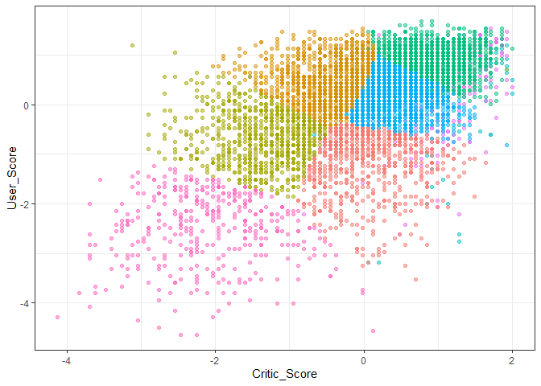
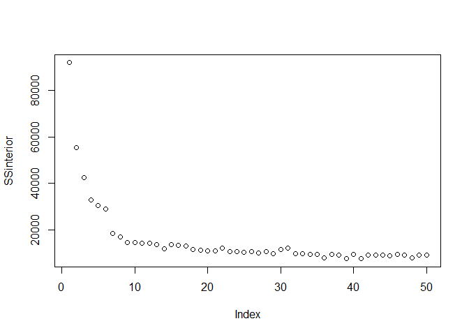
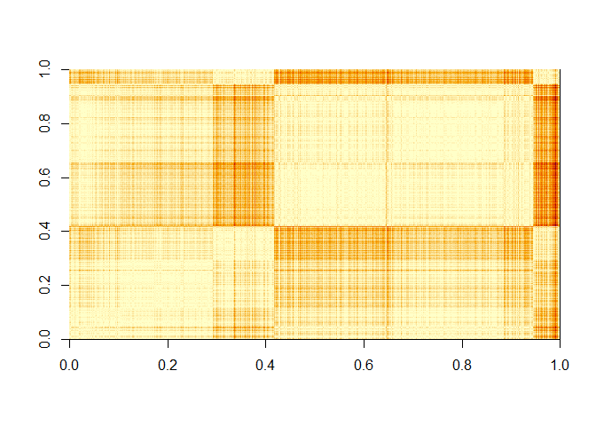
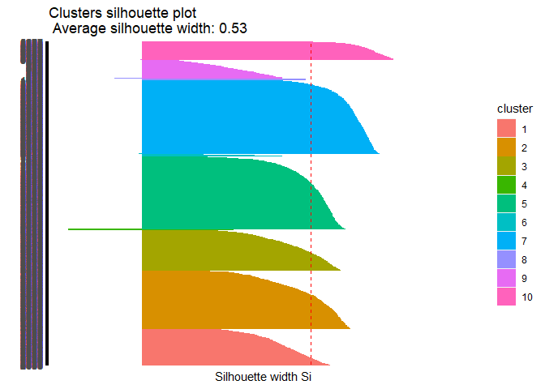
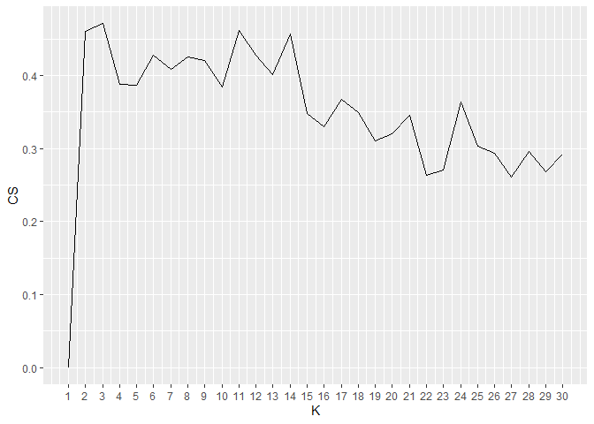

Analisis de clusters
================

Para el analisis de clusters vamos a analizar data de ventas de
videojuegos, echaremos un vistazo a las variables presentes.

``` r
library(tidyverse)

data  <- read.csv("video_games_sales.csv")

summary(data)
```

    ##      Name             Platform         Year_of_Release       Genre          
    ##  Length:16719       Length:16719       Length:16719       Length:16719      
    ##  Class :character   Class :character   Class :character   Class :character  
    ##  Mode  :character   Mode  :character   Mode  :character   Mode  :character  
    ##                                                                             
    ##                                                                             
    ##                                                                             
    ##                                                                             
    ##   Publisher            NA_Sales          EU_Sales         JP_Sales      
    ##  Length:16719       Min.   : 0.0000   Min.   : 0.000   Min.   : 0.0000  
    ##  Class :character   1st Qu.: 0.0000   1st Qu.: 0.000   1st Qu.: 0.0000  
    ##  Mode  :character   Median : 0.0800   Median : 0.020   Median : 0.0000  
    ##                     Mean   : 0.2633   Mean   : 0.145   Mean   : 0.0776  
    ##                     3rd Qu.: 0.2400   3rd Qu.: 0.110   3rd Qu.: 0.0400  
    ##                     Max.   :41.3600   Max.   :28.960   Max.   :10.2200  
    ##                                                                         
    ##   Other_Sales        Global_Sales      Critic_Score    Critic_Count   
    ##  Min.   : 0.00000   Min.   : 0.0100   Min.   :13.00   Min.   :  3.00  
    ##  1st Qu.: 0.00000   1st Qu.: 0.0600   1st Qu.:60.00   1st Qu.: 12.00  
    ##  Median : 0.01000   Median : 0.1700   Median :71.00   Median : 21.00  
    ##  Mean   : 0.04733   Mean   : 0.5335   Mean   :68.97   Mean   : 26.36  
    ##  3rd Qu.: 0.03000   3rd Qu.: 0.4700   3rd Qu.:79.00   3rd Qu.: 36.00  
    ##  Max.   :10.57000   Max.   :82.5300   Max.   :98.00   Max.   :113.00  
    ##                                       NA's   :8582    NA's   :8582    
    ##   User_Score          User_Count       Developer            Rating         
    ##  Length:16719       Min.   :    4.0   Length:16719       Length:16719      
    ##  Class :character   1st Qu.:   10.0   Class :character   Class :character  
    ##  Mode  :character   Median :   24.0   Mode  :character   Mode  :character  
    ##                     Mean   :  162.2                                        
    ##                     3rd Qu.:   81.0                                        
    ##                     Max.   :10665.0                                        
    ##                     NA's   :9129

Para clusterizar vamos a seleccoinar las variables de ventas y las
evaluaciones de cada videojuego. Para analizar el comportamiento vamos a
excluir ventas globales ya que es una variable linealmente dependiente
del resto de las ventas.

Antes de clusterizar debemos preparar la data:

  - Eliminando datos faltantes.

  - Pasar User\_score a numerico.

  - Escalar la data

<!-- end list -->

``` r
data$User_Score <- as.numeric(data$User_Score)
```

    ## Warning: NAs introducidos por coerción

``` r
data <- data %>% filter(!(is.na(Critic_Score) | is.na(User_Score))) %>% select(-Global_Sales)

data_numerica <- data[,c(6:9, 10, 12)]

data_escala = scale(data_numerica) %>% as_tibble()

data_escala %>% summary()
```

    ##     NA_Sales           EU_Sales          JP_Sales        Other_Sales      
    ##  Min.   :-0.40676   Min.   :-0.3432   Min.   :-0.2215   Min.   :-0.30580  
    ##  1st Qu.:-0.34407   1st Qu.:-0.3137   1st Qu.:-0.2215   1st Qu.:-0.26829  
    ##  Median :-0.25003   Median :-0.2549   Median :-0.2215   Median :-0.23078  
    ##  Mean   : 0.00000   Mean   : 0.0000   Mean   : 0.0000   Mean   : 0.00000  
    ##  3rd Qu.: 0.00074   3rd Qu.:-0.0340   3rd Qu.:-0.1863   3rd Qu.:-0.04323  
    ##  Max.   :42.80933   Max.   :42.2946   Max.   :22.6528   Max.   :39.34256  
    ##   Critic_Score       User_Score     
    ##  Min.   :-4.1244   Min.   :-4.6366  
    ##  1st Qu.:-0.5943   1st Qu.:-0.4735  
    ##  Median : 0.1261   Median : 0.2203  
    ##  Mean   : 0.0000   Mean   : 0.0000  
    ##  3rd Qu.: 0.7024   3rd Qu.: 0.7060  
    ##  Max.   : 1.9992   Max.   : 1.6774

Ya tenemos escalada la data, vamos a aplicar el algoritmo de kmedias,
que viene implementado en R base. Para probar, vamos a aplicar kmedias
con k = 10

``` r
modelo_kmeans <- kmeans(data_escala, centers = 10)

# creo la variable cluster en la tabla data_escalada
data_escala$clus <- modelo_kmeans$cluster %>% as.factor()

ggplot(data_escala, aes(Critic_Score, User_Score, color=clus)) +
  geom_point(alpha=0.5, show.legend = F) +
  theme_bw()
```

<!-- -->

Vamos a ver como evoluciona la suma de cuadrados intra-cluster en la
medida que aumentamos el numero de k

``` r
SSinterior <- numeric(50)

for(k in 1:50){
  modelo <- kmeans(data_escala, centers = k)
  SSinterior[k] <- modelo$tot.withinss
}

plot(SSinterior)
```

<!-- -->

## Evaluacion

Existen diversos metodos de evaluacion de calidad de los clusters
resultantes.

El primero que revisaremos es la inspeccion visual

``` r
# uso distancia euclidiana
tempDist <- dist(data_numerica) %>% as.matrix()

#reordeno filas y columnas en base al cluster obtenido
index <- sort(modelo_kmeans$cluster, index.return=TRUE)
tempDist <- tempDist[index$ix,index$ix]
rownames(tempDist) <- c(1:nrow(data))
colnames(tempDist) <- c(1:nrow(data))

image(tempDist)
```

<!-- -->

El siguiente metodo es el estadistico de Hopkins, que esta implementado
en la libreria factoextra.

``` r
library(factoextra)
```

    ## Warning: package 'factoextra' was built under R version 4.0.5

    ## Welcome! Want to learn more? See two factoextra-related books at https://goo.gl/ve3WBa

``` r
#Calcula el hopkins statistic 
res <- get_clust_tendency(data_numerica, n = 30, graph = FALSE)

print(res)
```

    ## $hopkins_stat
    ## [1] 0.9921878
    ## 
    ## $plot
    ## NULL

Luego vamos a implementar el indice de correlacion

``` r
#Correlation
#construyo matriz de correlacion ideal (cada entidad correlaciona 1 con su cluster)
tempMatrix <- matrix(0, nrow = nrow(data_escala), ncol = nrow(data_escala))
tempMatrix[which(index$x==1), which(index$x==1)]  <- 1
tempMatrix[which(index$x==2), which(index$x==2)]  <- 1
tempMatrix[which(index$x==3), which(index$x==3)]  <- 1
tempMatrix[which(index$x==4), which(index$x==4)]  <- 1
tempMatrix[which(index$x==5), which(index$x==5)]  <- 1
tempMatrix[which(index$x==6), which(index$x==6)]  <- 1
tempMatrix[which(index$x==7), which(index$x==7)]  <- 1
tempMatrix[which(index$x==8), which(index$x==8)]  <- 1
tempMatrix[which(index$x==9), which(index$x==9)]  <- 1
tempMatrix[which(index$x==10), which(index$x==10)] <- 1

#construyo matriz de disimilitud
tempDist2 <- 1/(1+tempDist)

#Calcula correlacion 
cor <- cor(tempMatrix[upper.tri(tempMatrix)],tempDist2[upper.tri(tempDist2)])

print(cor)
```

    ## [1] 0.4137548

Tambien implementaremos indice de cohesion y el de separacion, que son
muy similares.

``` r
library(flexclust) # usaremos la distancia implementada en flexclus (dist2) que maneja mejor objetos de diferente tamaño
```

    ## Warning: package 'flexclust' was built under R version 4.0.5

    ## Loading required package: grid

    ## Loading required package: lattice

    ## Loading required package: modeltools

    ## Loading required package: stats4

``` r
data_escala <- apply(data_escala,2,as.numeric)
 
#Cohesion
withinCluster <- numeric(10)
for (i in 1:10){
  tempData <- data_escala[which(modelo_kmeans$cluster == i),]
  withinCluster[i] <- sum(dist2(tempData,colMeans(tempData))^2)
}
cohesion = sum(withinCluster)
#es equivalente a model$tot.withinss en k-means
print(c(cohesion, modelo_kmeans$tot.withinss))
```

    ## [1] 12776.01 12776.01

``` r
#Separation
meanData <- colMeans(data_escala)
SSB <- numeric(10)
for (i in 1:10){
  tempData <- data_escala[which(modelo_kmeans$cluster==i),]
  SSB[i] <- nrow(tempData)*sum((meanData-colMeans(tempData))^2)
}
separation = sum(SSB)

print(separation)
```

    ## [1] 79114.97

Y finalmente aplicamos el coeficiente de silueta, implementado en
libreria cluser

``` r
library(cluster)

coefSil <- silhouette(modelo_kmeans$cluster,dist(data_escala))
summary(coefSil)
```

    ## Silhouette of 7017 units in 10 clusters from silhouette.default(x = modelo_kmeans$cluster, dist = dist(data_escala)) :
    ##  Cluster sizes and average silhouette widths:
    ##        787       1262        884         13       1587         52       1613 
    ## 0.44049456 0.51842811 0.48411666 0.02392717 0.52890014 0.22518957 0.65475803 
    ##         36        404        379 
    ## 0.28749821 0.27302134 0.71001054 
    ## Individual silhouette widths:
    ##    Min. 1st Qu.  Median    Mean 3rd Qu.    Max. 
    ## -0.2327  0.4469  0.5606  0.5310  0.6290  0.7901

``` r
#visualizamos el codigo de silueta de cada cluster
fviz_silhouette(coefSil) + coord_flip()
```

    ##    cluster size ave.sil.width
    ## 1        1  787          0.44
    ## 2        2 1262          0.52
    ## 3        3  884          0.48
    ## 4        4   13          0.02
    ## 5        5 1587          0.53
    ## 6        6   52          0.23
    ## 7        7 1613          0.65
    ## 8        8   36          0.29
    ## 9        9  404          0.27
    ## 10      10  379          0.71

<!-- -->

# Utilizamos el coeficiente de silueta para encontrar el mejor valor de K

``` r
coefSil=numeric(30)
for (k in 2:30){
  modelo <- kmeans(data_escala, centers = k)
  temp <- silhouette(modelo$cluster,dist(data_escala))
  coefSil[k] <- mean(temp[,3])
}
tempDF=data.frame(CS=coefSil,K=c(1:30))

ggplot(tempDF, aes(x=K, y=CS)) + 
  geom_line() +
  scale_x_continuous(breaks=c(1:30))
```

<!-- -->
