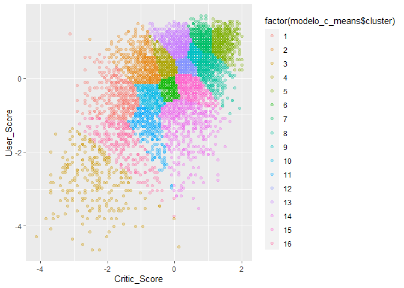
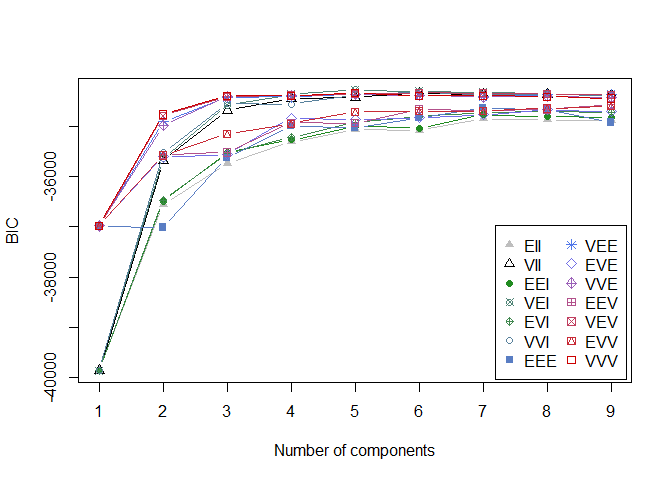

Clusters probabilisticos
================

Para este ejercicio seguiremos utilizando los datos de videojuegos que
hemos usado en sesiones anteriores, pero solo utilizaremos las variables
User Score y Critic Score para visualizar mejor los resultados en un
grafico 2D

``` r
library(tidyverse)

data_escalada  <- read.csv("video_games_sales.csv") %>% 
  mutate(User_Score = as.numeric(User_Score)) %>% 
  filter(!(is.na(Critic_Score) | is.na(User_Score))) %>% 
  select(-Global_Sales) %>% 
  select(Critic_Score, User_Score) %>% 
  scale() %>% 
  as_tibble()

data_escalada %>% summary()
```

    ##   Critic_Score       User_Score     
    ##  Min.   :-4.1244   Min.   :-4.6366  
    ##  1st Qu.:-0.5943   1st Qu.:-0.4735  
    ##  Median : 0.1261   Median : 0.2203  
    ##  Mean   : 0.0000   Mean   : 0.0000  
    ##  3rd Qu.: 0.7024   3rd Qu.: 0.7060  
    ##  Max.   : 1.9992   Max.   : 1.6774

El primer metodo que implementaremos es el clustering basado en
densidad, que esta implementado en la libreria DBSCAN

``` r
library(dbscan)

model = dbscan(data_escalada, eps = 0.1, minPts = 15)

model
```

    ## DBSCAN clustering for 7017 objects.
    ## Parameters: eps = 0.1, minPts = 15
    ## The clustering contains 16 cluster(s) and 2020 noise points.
    ## 
    ##    0    1    2    3    4    5    6    7    8    9   10   11   12   13   14   15 
    ## 2020 4732   68   44   15   17    5   15   38    7   16   10   15   11    2    1 
    ##   16 
    ##    1 
    ## 
    ## Available fields: cluster, eps, minPts

Se puede ver que el modelo genero 16 clusters basado en los parametros
minPts y eps que le entregamos a la funcion dbscan

En la figura a continuacion podemos ver que los clusters estan
repartidos por el espacio

``` r
ggplot(data_escalada, aes(Critic_Score, User_Score, color = factor(model$cluster))) + 
  geom_point(alpha = 0.3) 
```

<!-- -->

Se puede ver que hay diversos puntos que no quedan asignados a ningun
cluster dados los valores escogidos para la distancia minima.

Otros algoritmos como el c-means permiten asignarle un cluster a todos
los puntos

Para aplicar cmeans utilizaremos una libreria llama e1071, aunque hay
otras implementaciones

``` r
library(e1071)

modelo_c_means <- cmeans(data_escalada, 16, m=3) 

modelo_c_means$membership %>% head()
```

    ##                1          2           3          4          5          6
    ## [1,] 0.018344839 0.03394116 0.009900683 0.05882631 0.04148791 0.04097695
    ## [2,] 0.015602462 0.02510738 0.009211879 0.03602302 0.08214441 0.02946412
    ## [3,] 0.014447130 0.02419140 0.008252474 0.03704440 0.04886316 0.03016808
    ## [4,] 0.008258937 0.01204594 0.005255743 0.01569934 0.71230280 0.01394895
    ## [5,] 0.086924994 0.09746260 0.021395854 0.05864054 0.02148145 0.07571232
    ## [6,] 0.017132517 0.02559259 0.010685636 0.03416246 0.31887887 0.02994806
    ##               7          8          9         10          11         12
    ## [1,] 0.07117484 0.07951322 0.18810819 0.02729462 0.018797204 0.17422787
    ## [2,] 0.27972484 0.11912519 0.16190530 0.02153880 0.016143433 0.06366559
    ## [3,] 0.09109745 0.14122271 0.34113123 0.02079604 0.015116802 0.08401152
    ## [4,] 0.05572954 0.04070967 0.03428522 0.01083322 0.008630922 0.02293302
    ## [5,] 0.02535125 0.02820280 0.03048999 0.26927117 0.072862747 0.03904562
    ## [6,] 0.15283127 0.10285094 0.08497985 0.02282739 0.017905921 0.05240532
    ##              13         14         15          16
    ## [1,] 0.13869094 0.02622563 0.05859741 0.013892214
    ## [2,] 0.06582072 0.02219903 0.03989162 0.012432202
    ## [3,] 0.06637554 0.02161932 0.04430237 0.011360370
    ## [4,] 0.02302515 0.01164889 0.01782794 0.006864702
    ## [5,] 0.03488922 0.05193642 0.04703012 0.039302905
    ## [6,] 0.05215711 0.02444512 0.03910095 0.014096002

El algoritmo cmeans asigna como cluster al que tenga mayor probabilidad

``` r
ggplot(data_escalada, aes(Critic_Score, User_Score, color = factor(modelo_c_means$cluster))) + 
  geom_point(alpha = 0.3) 
```

<!-- -->

Para los modelos de clustering difuso podemos calcular el Coeficiente de
partición difusa (FPC)

``` r
matriz <- modelo_c_means$membership%*%t(modelo_c_means$membership) # producto matricial

(FPC <- sum(matriz*diag(nrow(matriz)))/nrow(matriz))
```

    ## [1] 0.129534

El valor del FPC es bajo, lo que significa que los grupos tienen alta
variabilidad, y se puede confirmar en la figura ya que no se ven grupos
definidos.

Al igual que en cmeans, los metodos de GMM permiten obtener clusters
difusos pero utilizando modelos probabilisticos.

Para aplicar GMM, utilizamos la libreria mclust

``` r
library(mclust)

model_gmm = Mclust(data_escalada)

model_gmm 
```

    ## 'Mclust' model object: (VEI,5) 
    ## 
    ## Available components: 
    ##  [1] "call"           "data"           "modelName"      "n"             
    ##  [5] "d"              "G"              "BIC"            "loglik"        
    ##  [9] "df"             "bic"            "icl"            "hypvol"        
    ## [13] "parameters"     "z"              "classification" "uncertainty"

``` r
summary(model_gmm, parameters = TRUE)
```

    ## ---------------------------------------------------- 
    ## Gaussian finite mixture model fitted by EM algorithm 
    ## ---------------------------------------------------- 
    ## 
    ## Mclust VEI (diagonal, equal shape) model with 5 components: 
    ## 
    ##  log-likelihood    n df       BIC       ICL
    ##       -17050.27 7017 20 -34277.66 -39069.84
    ## 
    ## Clustering table:
    ##    1    2    3    4    5 
    ##  389 1754  355 2130 2389 
    ## 
    ## Mixing probabilities:
    ##          1          2          3          4          5 
    ## 0.06185702 0.27961114 0.05306154 0.26929087 0.33617944 
    ## 
    ## Means:
    ##                   [,1]       [,2]     [,3]      [,4]       [,5]
    ## Critic_Score -1.758215 -0.5707172 1.371369 0.7016454 0.01970128
    ## User_Score   -2.395337 -0.6413899 1.075505 0.7171661 0.22997824
    ## 
    ## Variances:
    ## [,,1]
    ##              Critic_Score User_Score
    ## Critic_Score     1.065965  0.0000000
    ## User_Score       0.000000  0.6822195
    ## [,,2]
    ##              Critic_Score User_Score
    ## Critic_Score    0.8329614  0.0000000
    ## User_Score      0.0000000  0.5330967
    ## [,,3]
    ##              Critic_Score User_Score
    ## Critic_Score   0.07606634 0.00000000
    ## User_Score     0.00000000 0.04868258
    ## [,,4]
    ##              Critic_Score User_Score
    ## Critic_Score    0.1823745    0.00000
    ## User_Score      0.0000000    0.11672
    ## [,,5]
    ##              Critic_Score User_Score
    ## Critic_Score    0.4000643  0.0000000
    ## User_Score      0.0000000  0.2560419

El modelo genero 5 clusters los que se pueden visualizar igual que los
ejemplos anteriores

``` r
ggplot(data_escalada) + 
  aes(x=Critic_Score, y=User_Score, color=factor(model_gmm$classification)) + 
  geom_point(alpha=0.5) 
```

<!-- -->

El modelo aplicó todas las formas posibles de la matriz de covarianzas,
y permite visualizar como evoluciona el BIC a medida que aumentamos el
numero de clusters. Esta visualizacion permite ver que la mayoria de los
modelos deja de mejorar sobre 5 clusters

``` r
plot(model_gmm, what = "BIC")
```

<!-- -->
