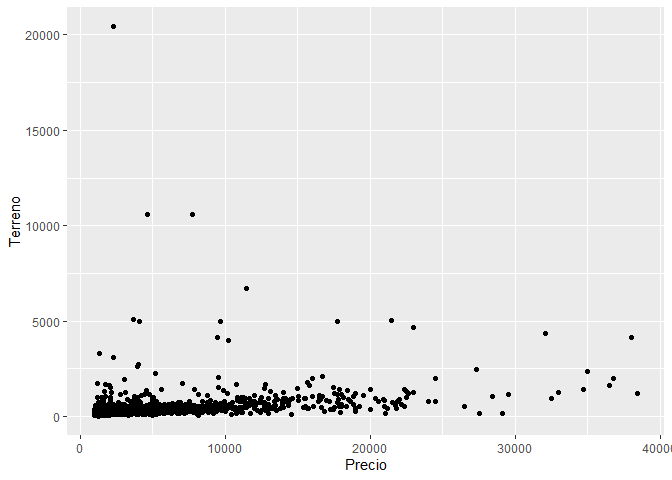
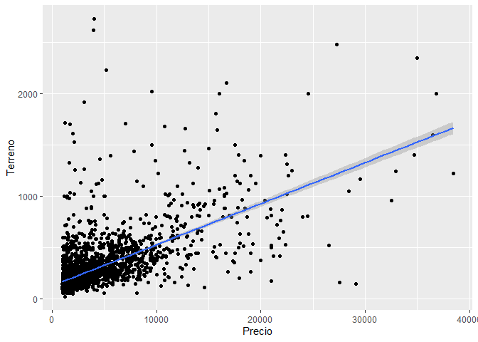
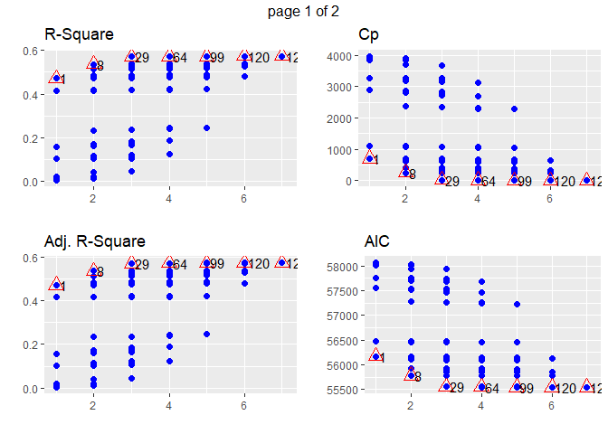
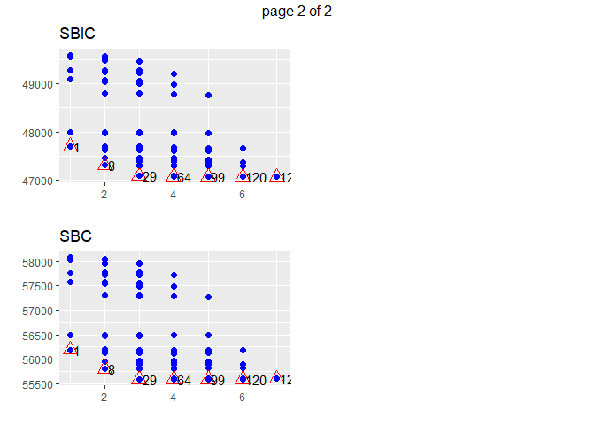

Analisis de Regresion
================

Para el analisis de regresion vamos a utilizar datos de precios de
viviendas en Santiago de Chile. Lo primero que haremos es cargar los
datos y revisarlos con la funcion summary

``` r
library(tidyverse)

propiedades <- read_csv("propiedades.csv")

summary(propiedades)
```

    ##      Precio         Terreno          Construido     Año_Construccion
    ##  Min.   : 1001   Min.   :   26.0   Min.   :   7.0   Min.   :1900    
    ##  1st Qu.: 1394   1st Qu.:  134.0   1st Qu.:  65.0   1st Qu.:1979    
    ##  Median : 2002   Median :  190.0   Median :  88.0   Median :1996    
    ##  Mean   : 3635   Mean   :  303.9   Mean   : 108.9   Mean   :1990    
    ##  3rd Qu.: 3964   3rd Qu.:  300.0   3rd Qu.: 128.0   3rd Qu.:2005    
    ##  Max.   :38424   Max.   :20427.0   Max.   :1411.0   Max.   :2013    
    ##  densidad_barrio      colegio_15m        jardin_15m      trabajo_15m   
    ##  Min.   :   0.0384   Min.   :0.00000   Min.   :0.0000   Min.   :0.000  
    ##  1st Qu.:  62.4307   1st Qu.:0.00000   1st Qu.:1.0000   1st Qu.:0.000  
    ##  Median : 118.9393   Median :0.00000   Median :1.0000   Median :0.000  
    ##  Mean   : 132.7480   Mean   :0.07833   Mean   :0.8487   Mean   :0.023  
    ##  3rd Qu.: 186.7929   3rd Qu.:0.00000   3rd Qu.:1.0000   3rd Qu.:0.000  
    ##  Max.   :1305.9717   Max.   :1.00000   Max.   :1.0000   Max.   :1.000

Vemos que en la base de datos se encuentran columnas del Precio de las
viviendas, asi como la superficie de los terrenos, superficie
construida, año de construccion, y algunas variables relativas al
barrio, como densidad habitacional del barrio, y la presencia de
colegios, jardines o lugares de trabajo a 15 minutos caminando de la
ubicacion de la casa.

Para comenzar buscaremos una relacion lineal entre el precio de la
vivienda con los metros construidos. Antes de ejecutar la regresion
inspeccionaremos los datos

``` r
ggplot(propiedades, aes(Precio, Terreno)) + 
  geom_point()
```

<!-- -->

Podemos ver que hay algunos datos atipicos que no reflejan el
comportamiento esperado del mercado. Dado esto, los vamos a excluir del
analisis.

``` r
propiedades <- propiedades %>% filter(Terreno < 3000)

ggplot(propiedades, aes(Precio, Terreno)) + 
  geom_point() +
  geom_smooth(method = "lm")
```

    ## `geom_smooth()` using formula 'y ~ x'

<!-- -->

Ahora ejecutaremos la regresion con las variables señaladas utilizando
la funcion lm (linear model), que viene en R base

``` r
regresion_lineal <- lm(Precio~Terreno, propiedades)

summary(regresion_lineal)
```

    ## 
    ## Call:
    ## lm(formula = Precio ~ Terreno, data = propiedades)
    ## 
    ## Residuals:
    ##      Min       1Q   Median       3Q      Max 
    ## -25014.3  -1072.1   -489.3    346.6  26789.5 
    ## 
    ## Coefficients:
    ##             Estimate Std. Error t value Pr(>|t|)    
    ## (Intercept) 770.7969    83.6095   9.219   <2e-16 ***
    ## Terreno      10.3715     0.2254  46.018   <2e-16 ***
    ## ---
    ## Signif. codes:  0 '***' 0.001 '**' 0.01 '*' 0.05 '.' 0.1 ' ' 1
    ## 
    ## Residual standard error: 3111 on 2982 degrees of freedom
    ## Multiple R-squared:  0.4153, Adjusted R-squared:  0.4151 
    ## F-statistic:  2118 on 1 and 2982 DF,  p-value: < 2.2e-16

Los resultados de la regresion nos indican que los valores de los
parametros son 770 para el intercepto y 10 para el coeficiente asociado
a la variable superficie de terreno.

Tambien se puede observar que el coeficiente de determinacion R2 es de
.41, lo que significa que el 41% de la varianza del precio esta
explicada por el modelo lineal.

El metodo de regresion lineal tambien permite obtener las desviaciones
estandar de los parametros, y por lo tanto se puede calcular el
estadistico t-student y el valor p. En la tabla resumen se puede ver que
ambos parametros tienen significancia estadistica de 100%, lo que
significa que aportan realmente en la explicacion del precio.

Puede suceder que la relacion entre ambas variables tenga un
comportamiento logaritmico en lugar de lineal, por lo que vamos a probar
esta hipotesis aplicando logaritmo natural en ambas variables

``` r
regresion_log <- lm(log(Precio)~log(Terreno), propiedades)

summary(regresion_log)
```

    ## 
    ## Call:
    ## lm(formula = log(Precio) ~ log(Terreno), data = propiedades)
    ## 
    ## Residuals:
    ##      Min       1Q   Median       3Q      Max 
    ## -2.44462 -0.34656 -0.00447  0.31638  2.73934 
    ## 
    ## Coefficients:
    ##              Estimate Std. Error t value Pr(>|t|)    
    ## (Intercept)   3.39667    0.08548   39.74   <2e-16 ***
    ## log(Terreno)  0.82685    0.01583   52.25   <2e-16 ***
    ## ---
    ## Signif. codes:  0 '***' 0.001 '**' 0.01 '*' 0.05 '.' 0.1 ' ' 1
    ## 
    ## Residual standard error: 0.545 on 2982 degrees of freedom
    ## Multiple R-squared:  0.4779, Adjusted R-squared:  0.4778 
    ## F-statistic:  2730 on 1 and 2982 DF,  p-value: < 2.2e-16

Podemos ver que el coeficiente de determinacion mejoro a un 47% y que
ambos coeficientes siguen siendo estadisticamente significativos, lo que
significia que este es un mejor modelo que el anterior.

Tambien es posible que la relacion entre ambas variables tenga una forma
polinomica. Vamos a probar con un polinomio de orden 3.

``` r
propiedades$Terreno2 <- propiedades$Terreno^2
propiedades$Terreno3 <- propiedades$Terreno^3

regresion_poli <- lm(log(Precio) ~ Terreno + Terreno2 + Terreno3, propiedades)

summary(regresion_poli)
```

    ## 
    ## Call:
    ## lm(formula = log(Precio) ~ Terreno + Terreno2 + Terreno3, data = propiedades)
    ## 
    ## Residuals:
    ##      Min       1Q   Median       3Q      Max 
    ## -2.18588 -0.33243 -0.01676  0.30433  2.77481 
    ## 
    ## Coefficients:
    ##               Estimate Std. Error t value Pr(>|t|)    
    ## (Intercept)  6.783e+00  2.908e-02 233.260   <2e-16 ***
    ## Terreno      5.333e-03  1.799e-04  29.641   <2e-16 ***
    ## Terreno2    -3.620e-06  2.371e-07 -15.266   <2e-16 ***
    ## Terreno3     7.499e-10  7.622e-11   9.839   <2e-16 ***
    ## ---
    ## Signif. codes:  0 '***' 0.001 '**' 0.01 '*' 0.05 '.' 0.1 ' ' 1
    ## 
    ## Residual standard error: 0.5408 on 2980 degrees of freedom
    ## Multiple R-squared:  0.4863, Adjusted R-squared:  0.4858 
    ## F-statistic: 940.4 on 3 and 2980 DF,  p-value: < 2.2e-16

Se puede ver que la regresion polinomica tiene mejor coeficiente R2 que
el modelo original, y que todos los coeficientes siguen siendo
estadisticamente significativos.

Hasta ahora solo hemos probado con una variable, vamos a ver si
incluimos el resto de las variables presentes en la base de datos.

``` r
regresion_multi <- lm(Precio ~ Terreno+Construido+Año_Construccion+densidad_barrio+colegio_15m + jardin_15m + trabajo_15m , propiedades)

summary(regresion_multi)
```

    ## 
    ## Call:
    ## lm(formula = Precio ~ Terreno + Construido + Año_Construccion + 
    ##     densidad_barrio + colegio_15m + jardin_15m + trabajo_15m, 
    ##     data = propiedades)
    ## 
    ## Residuals:
    ##      Min       1Q   Median       3Q      Max 
    ## -22273.2   -821.1   -192.0    342.8  27683.7 
    ## 
    ## Coefficients:
    ##                    Estimate Std. Error t value Pr(>|t|)    
    ## (Intercept)       285.36614 5483.07374   0.052  0.95850    
    ## Terreno             4.85373    0.27070  17.930  < 2e-16 ***
    ## Construido         22.15884    0.86965  25.480  < 2e-16 ***
    ## Año_Construccion   -0.05872    2.72728  -0.022  0.98282    
    ## densidad_barrio    -1.68597    0.59040  -2.856  0.00432 ** 
    ## colegio_15m      2970.93771  192.27722  15.451  < 2e-16 ***
    ## jardin_15m       -369.39854  151.86707  -2.432  0.01506 *  
    ## trabajo_15m       762.48365  326.30383   2.337  0.01952 *  
    ## ---
    ## Signif. codes:  0 '***' 0.001 '**' 0.01 '*' 0.05 '.' 0.1 ' ' 1
    ## 
    ## Residual standard error: 2660 on 2976 degrees of freedom
    ## Multiple R-squared:  0.5733, Adjusted R-squared:  0.5723 
    ## F-statistic: 571.3 on 7 and 2976 DF,  p-value: < 2.2e-16

Se puede ver que el modelo lineal multiple tiene un coeficiente de
determinacion de 57%, y que hay algunas variables que tienen
significancia estadistica menor a 99%, e incluso hay variables que no
son relevantes en este modelo como el año de construccion.

Esto no significa que el año no sea relevante, sino que no lo es en ESTE
MODELO.

Ahora vamos a probar diferentes metodos para determinar cual es la mejor
combinacion de variables para el modelo lineal.

Los metodos de determinacion de modelos estan implementados en la
libreria olsrr, y el primer metodo que probaremos es el de fuerza bruta

``` r
library(olsrr)
```

    ## Warning: package 'olsrr' was built under R version 4.0.5

``` r
fuerza_bruta <- ols_step_all_possible(regresion_multi)

plot(fuerza_bruta)
```

<!-- --><!-- -->

Luego el metodo de seleccion hacia adelante

``` r
sel_adelante <- ols_step_forward_p(regresion_multi)

sel_adelante
```

    ## 
    ##                                   Selection Summary                                    
    ## --------------------------------------------------------------------------------------
    ##         Variable                         Adj.                                             
    ## Step        Entered        R-Square    R-Square      C(p)         AIC          RMSE       
    ## --------------------------------------------------------------------------------------
    ##    1    Terreno              0.5362      0.5359    257.2822    55782.0264    2771.3178    
    ##    2    Construido           0.5700      0.5696     23.3373    55558.0636    2668.7983    
    ##    3    colegio_15m          0.5717      0.5711     13.4018    55548.1654    2663.9299    
    ##    4    densidad_barrio      0.5725      0.5718      9.4926    55544.2572    2661.7407    
    ##    5    jardin_15m           0.5733      0.5725      6.0005    55540.7553    2659.7346    
    ##    6    trabajo_15m              NA          NA          NA            NA           NA    
    ## --------------------------------------------------------------------------------------

Y finalmente el metodo de seleccion hacia atras

``` r
sel_atras <- ols_step_backward_p(regresion_multi)

sel_atras
```

    ## 
    ## 
    ##                                  Elimination Summary                                  
    ## -------------------------------------------------------------------------------------
    ##         Variable                          Adj.                                           
    ## Step        Removed         R-Square    R-Square     C(p)        AIC          RMSE       
    ## -------------------------------------------------------------------------------------
    ##    1    Año_Construccion      0.5733      0.5725    6.0005    55540.7553    2659.7346    
    ## -------------------------------------------------------------------------------------
