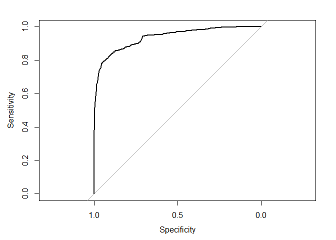

Analisis de clasificación
================

Para el analisis de clasificacion vamos a volver a utilizar datos de
propiedades, pero esta vez tienen una columna adicional.

Vamos a cargar la propiedades y echarle un vistazo con la funcion
glimpse

``` r
library(tidyverse)

propiedades <- read_csv("propiedades2.csv")

propiedades %>% glimpse()
```

    ## Rows: 3,000
    ## Columns: 9
    ## $ Precio           <dbl> 1384, 2006, 1685, 1242, 1592, 1292, 1900, 1268, 7500,~
    ## $ Terreno          <dbl> 69, 45, 47, 25, 34, 29, 114, 37, 133, 33, 160, 31, 13~
    ## $ Construido       <dbl> 69, 45, 47, 25, 34, 29, 65, 37, 133, 33, 84, 31, 138,~
    ## $ Año_Construccion <dbl> 1972, 1996, 2010, 2005, 2010, 2010, 2012, 2001, 1997,~
    ## $ densidad_barrio  <dbl> 160.45882, 105.82421, 1295.27435, 202.47675, 728.8508~
    ## $ colegio_15m      <dbl> 0, 1, 1, 0, 1, 0, 0, 0, 0, 1, 0, 0, 1, 0, 1, 0, 1, 0,~
    ## $ jardin_15m       <dbl> 1, 1, 1, 1, 1, 1, 0, 1, 1, 1, 1, 1, 1, 1, 1, 0, 0, 1,~
    ## $ trabajo_15m      <dbl> 0, 0, 0, 0, 1, 0, 0, 0, 1, 1, 0, 0, 0, 0, 0, 0, 0, 0,~
    ## $ es_depto         <lgl> TRUE, TRUE, TRUE, TRUE, TRUE, TRUE, FALSE, TRUE, TRUE~

Vemos que los datos ahora traen una columna que se llama es\_depto, la
cual tiene valores TRUE o FALSE. Esto representa si son departamentos o
casas.

Ahora vamos a ver si podemos clasificar las entidades en departamentos o
casas utilizando un modelo de clasificacion. En particular utilizaremos
una regresion logistica.

El primer modelo lo haremos con una funcion logistica simple, la cual se
hace con la funcion glm que esta en R base

``` r
modelo_logistico <- glm(es_depto ~ Terreno, propiedades, family = "binomial")
```

    ## Warning: glm.fit: fitted probabilities numerically 0 or 1 occurred

``` r
summary(modelo_logistico)
```

    ## 
    ## Call:
    ## glm(formula = es_depto ~ Terreno, family = "binomial", data = propiedades)
    ## 
    ## Deviance Residuals: 
    ##     Min       1Q   Median       3Q      Max  
    ## -2.2784  -0.2079   0.3255   0.4889   4.4823  
    ## 
    ## Coefficients:
    ##             Estimate Std. Error z value Pr(>|z|)    
    ## (Intercept)  4.33448    0.15035   28.83   <2e-16 ***
    ## Terreno     -0.03027    0.00120  -25.23   <2e-16 ***
    ## ---
    ## Signif. codes:  0 '***' 0.001 '**' 0.01 '*' 0.05 '.' 0.1 ' ' 1
    ## 
    ## (Dispersion parameter for binomial family taken to be 1)
    ## 
    ##     Null deviance: 3920.5  on 2999  degrees of freedom
    ## Residual deviance: 2087.3  on 2998  degrees of freedom
    ## AIC: 2091.3
    ## 
    ## Number of Fisher Scoring iterations: 7

Los resultados de la regresion nos dicen que tanto el intercepto como el
terreno son variables estadisticamente significativas para clasificar
una propiedad.

Este modelo no entrega un coeficiente de determinacion ya que este valor
no tiene sentido en los problemas de clasificacion. Dado esto, para
calcular la bondad del modelo vamos a calcular el valor del area bajo la
curva ROC, conocida como AUC.

Este calculo esta implementado en la libreria pROC

``` r
library(pROC)
```

    ## Warning: package 'pROC' was built under R version 4.0.4

    ## Type 'citation("pROC")' for a citation.

    ## 
    ## Attaching package: 'pROC'

    ## The following objects are masked from 'package:stats':
    ## 
    ##     cov, smooth, var

``` r
prob <- predict(modelo_logistico,type=c("response"))

propiedades$prob <- prob

curva_roc <- roc(es_depto ~ prob, data = propiedades)
```

    ## Setting levels: control = FALSE, case = TRUE

    ## Setting direction: controls < cases

``` r
plot(curva_roc)    
```

<!-- -->

``` r
auc(curva_roc)
```

    ## Area under the curve: 0.9366

Vemos que el valor del AUC es de 93%, lo que significa que el modelo
tiene un gran poder de clasificacion. Ahora vamos a ver si la AUC mejora
al incorporar mas variables, utilizando un modelo logistico
multivariable.

``` r
propiedades$prob <- NULL

modelo_logistico_multi <- glm(es_depto ~ ., propiedades, family = "binomial")
```

    ## Warning: glm.fit: fitted probabilities numerically 0 or 1 occurred

``` r
summary(modelo_logistico_multi)
```

    ## 
    ## Call:
    ## glm(formula = es_depto ~ ., family = "binomial", data = propiedades)
    ## 
    ## Deviance Residuals: 
    ##     Min       1Q   Median       3Q      Max  
    ## -4.4268   0.0000   0.0508   0.1627   2.6334  
    ## 
    ## Coefficients:
    ##                    Estimate Std. Error z value Pr(>|z|)    
    ## (Intercept)      -7.128e+01  1.613e+01  -4.419 9.92e-06 ***
    ## Precio            4.106e-04  5.575e-05   7.365 1.77e-13 ***
    ## Terreno          -2.329e-01  1.812e-02 -12.858  < 2e-16 ***
    ## Construido        2.032e-01  1.704e-02  11.925  < 2e-16 ***
    ## Año_Construccion  3.785e-02  8.041e-03   4.707 2.51e-06 ***
    ## densidad_barrio   1.255e-03  8.461e-04   1.484 0.137873    
    ## colegio_15m       2.748e+00  8.233e-01   3.338 0.000843 ***
    ## jardin_15m        7.048e-02  5.167e-01   0.136 0.891509    
    ## trabajo_15m       1.354e+00  9.832e-01   1.377 0.168478    
    ## ---
    ## Signif. codes:  0 '***' 0.001 '**' 0.01 '*' 0.05 '.' 0.1 ' ' 1
    ## 
    ## (Dispersion parameter for binomial family taken to be 1)
    ## 
    ##     Null deviance: 3920.5  on 2999  degrees of freedom
    ## Residual deviance:  375.4  on 2991  degrees of freedom
    ## AIC: 393.4
    ## 
    ## Number of Fisher Scoring iterations: 12

``` r
propiedades$prob_multi <- predict(modelo_logistico_multi, type=c("response"))

auc(roc(es_depto ~ prob_multi, data = propiedades))
```

    ## Setting levels: control = FALSE, case = TRUE

    ## Setting direction: controls < cases

    ## Area under the curve: 0.9897

Al incluir todas las variables vemos que algunas de ellas tienen
significancia estadistica, pero otras no, por lo que deberian ser
descartadas en el modelo.

El AUC mejoro desde un 93% a un 98%, lo que significa que en el 98% de
lo casos las entidades son clasificadas de manera exitosa. Estos
resultados pueden darse debido a sobreentrenamiento del modelo, por lo
que haremos la prueba con un conjunto de entrenamiento y un conjunto de
prueba.

``` r
set.seed(42)
muestra <- sample(1:nrow(propiedades), nrow(propiedades)*.8)

data_train <- propiedades[muestra,]
data_test <- propiedades[-muestra,]

modelo_logistico_multi <- glm(es_depto ~ Precio + Terreno + Construido + Año_Construccion + colegio_15m, data_train, family = "binomial")
```

    ## Warning: glm.fit: fitted probabilities numerically 0 or 1 occurred

``` r
summary(modelo_logistico_multi)
```

    ## 
    ## Call:
    ## glm(formula = es_depto ~ Precio + Terreno + Construido + Año_Construccion + 
    ##     colegio_15m, family = "binomial", data = data_train)
    ## 
    ## Deviance Residuals: 
    ##     Min       1Q   Median       3Q      Max  
    ## -4.7567   0.0000   0.0639   0.1587   2.2875  
    ## 
    ## Coefficients:
    ##                    Estimate Std. Error z value Pr(>|z|)    
    ## (Intercept)      -5.803e+01  1.753e+01  -3.310 0.000934 ***
    ## Precio            4.021e-04  5.739e-05   7.006 2.45e-12 ***
    ## Terreno          -2.473e-01  2.076e-02 -11.912  < 2e-16 ***
    ## Construido        2.164e-01  1.955e-02  11.068  < 2e-16 ***
    ## Año_Construccion  3.157e-02  8.808e-03   3.585 0.000337 ***
    ## colegio_15m       2.653e+00  8.679e-01   3.057 0.002236 ** 
    ## ---
    ## Signif. codes:  0 '***' 0.001 '**' 0.01 '*' 0.05 '.' 0.1 ' ' 1
    ## 
    ## (Dispersion parameter for binomial family taken to be 1)
    ## 
    ##     Null deviance: 3130.61  on 2399  degrees of freedom
    ## Residual deviance:  288.48  on 2394  degrees of freedom
    ## AIC: 300.48
    ## 
    ## Number of Fisher Scoring iterations: 12

``` r
data_test$prob_multi <- predict(modelo_logistico_multi, data_test, type=c("response"))

auc(roc(es_depto ~ prob_multi, data = data_test))
```

    ## Setting levels: control = FALSE, case = TRUE

    ## Setting direction: controls < cases

    ## Area under the curve: 0.9839

Vemos que el AUC bajo un poco de 98.9% a 98.4% pero sigue siendo un
excelente resultado, y dado que el conjunto de entrenamiento era
diferente al conjunto de prueba, podemos decir que el modelo no estaba
sobre entrenado.
