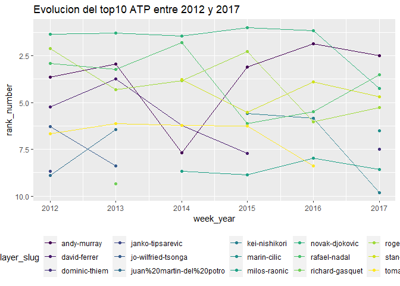

Tipos de datos
================

Existen diversos tipos de variables, como las numericas, de texto, de
fecha u ordinales.

Para analizarlos, lo primero que debemos hacer es cargar la data
tabular, utilizando la funcion read.csv()

``` r
data <- read.csv("rankingsATP.csv") 

head(data)
```

    ##   week_title week_year week_month week_day rank_text rank_number move_positions
    ## 1 2017.11.20      2017         11       20         1           1             NA
    ## 2 2017.11.20      2017         11       20         2           2             NA
    ## 3 2017.11.20      2017         11       20         3           3              3
    ## 4 2017.11.20      2017         11       20         4           4              1
    ## 5 2017.11.20      2017         11       20         5           5              1
    ## 6 2017.11.20      2017         11       20         6           6              1
    ##   move_direction player_age ranking_points tourneys_played
    ## 1                        31          10645              18
    ## 2                        36           9605              17
    ## 3             up         26           5150              23
    ## 4           down         20           4610              25
    ## 5           down         24           4015              27
    ## 6           down         29           3805              22
    ##                                   player_url      player_slug player_id
    ## 1     /en/players/rafael-nadal/n409/overview     rafael-nadal      n409
    ## 2    /en/players/roger-federer/f324/overview    roger-federer      f324
    ## 3  /en/players/grigor-dimitrov/d875/overview  grigor-dimitrov      d875
    ## 4 /en/players/alexander-zverev/z355/overview alexander-zverev      z355
    ## 5    /en/players/dominic-thiem/tb69/overview    dominic-thiem      tb69
    ## 6      /en/players/marin-cilic/c977/overview      marin-cilic      c977

``` r
str(data)
```

    ## 'data.frame':    755021 obs. of  14 variables:
    ##  $ week_title     : chr  "2017.11.20" "2017.11.20" "2017.11.20" "2017.11.20" ...
    ##  $ week_year      : int  2017 2017 2017 2017 2017 2017 2017 2017 2017 2017 ...
    ##  $ week_month     : int  11 11 11 11 11 11 11 11 11 11 ...
    ##  $ week_day       : int  20 20 20 20 20 20 20 20 20 20 ...
    ##  $ rank_text      : chr  "1" "2" "3" "4" ...
    ##  $ rank_number    : int  1 2 3 4 5 6 7 8 9 10 ...
    ##  $ move_positions : int  NA NA 3 1 1 1 1 1 2 NA ...
    ##  $ move_direction : chr  "" "" "up" "down" ...
    ##  $ player_age     : int  31 36 26 20 24 29 26 25 32 26 ...
    ##  $ ranking_points : int  10645 9605 5150 4610 4015 3805 3775 3165 3150 2615 ...
    ##  $ tourneys_played: int  18 17 23 25 27 22 26 22 15 25 ...
    ##  $ player_url     : chr  "/en/players/rafael-nadal/n409/overview" "/en/players/roger-federer/f324/overview" "/en/players/grigor-dimitrov/d875/overview" "/en/players/alexander-zverev/z355/overview" ...
    ##  $ player_slug    : chr  "rafael-nadal" "roger-federer" "grigor-dimitrov" "alexander-zverev" ...
    ##  $ player_id      : chr  "n409" "f324" "d875" "z355" ...

Vemos que en la tabla registros con datos faltantes, y otros con datos
no validos (NA), vamos a validarlo con la funcion summary()

``` r
summary(data)
```

    ##   week_title          week_year      week_month        week_day    
    ##  Length:755021      Min.   :2010   Min.   : 1.000   Min.   : 1.00  
    ##  Class :character   1st Qu.:2012   1st Qu.: 4.000   1st Qu.: 9.00  
    ##  Mode  :character   Median :2014   Median : 7.000   Median :16.00  
    ##                     Mean   :2014   Mean   : 6.674   Mean   :15.83  
    ##                     3rd Qu.:2015   3rd Qu.:10.000   3rd Qu.:23.00  
    ##                     Max.   :2017   Max.   :12.000   Max.   :31.00  
    ##                                                                    
    ##   rank_text          rank_number   move_positions    move_direction    
    ##  Length:755021      Min.   :   1   Min.   :   1.00   Length:755021     
    ##  Class :character   1st Qu.: 509   1st Qu.:   2.00   Class :character  
    ##  Mode  :character   Median :1018   Median :   4.00   Mode  :character  
    ##                     Mean   :1016   Mean   :  17.07                     
    ##                     3rd Qu.:1510   3rd Qu.:  10.00                     
    ##                     Max.   :2271   Max.   :1354.00                     
    ##                                    NA's   :99317                       
    ##    player_age    ranking_points    tourneys_played  player_url       
    ##  Min.   :13.00   Min.   :    0.0   Min.   : 1.00   Length:755021     
    ##  1st Qu.:20.00   1st Qu.:    2.0   1st Qu.: 4.00   Class :character  
    ##  Median :22.00   Median :    9.0   Median :10.00   Mode  :character  
    ##  Mean   :23.04   Mean   :  120.8   Mean   :12.35                     
    ##  3rd Qu.:26.00   3rd Qu.:   65.0   3rd Qu.:20.00                     
    ##  Max.   :66.00   Max.   :16950.0   Max.   :45.00                     
    ##  NA's   :501                                                         
    ##  player_slug         player_id        
    ##  Length:755021      Length:755021     
    ##  Class :character   Class :character  
    ##  Mode  :character   Mode  :character  
    ##                                       
    ##                                       
    ##                                       
    ## 

También nos interea explorar el numero de filas y de columnas de la
tabla

``` r
dim(data)
```

    ## [1] 755021     14

# Pre procesamiento de la data

El pre procesamiento de la data es un conjunto de pasos que debe
ejecutarse con un uso especifico, no es un proceso general para la data.

En este caso el uso específico lo definiremos como: Estudiar la
evolución anual del top 10 de jugadores del tenis ATP desde el año
2012.

## Reducción de dimensionalidad y selección de variables

Para simplificar el análisis consideraremos:

  - Data desde el año 2012.
  - Variables week\_year, rank\_number, player\_slug

<!-- end list -->

``` r
# en R base definimos el nuevo objeto data1 al especificar filas y columnas de la data original
# los corchetes cuadrados denotan [fila, columna]
data1 <- data[data$week_year >= 2012, c("week_year", "rank_number", "player_slug")]

dim(data1)
```

    ## [1] 576872      3

El mismo resultado puede obtenerse utilizando un dialecto de R llamado
tidyverse

``` r
library(tidyverse)

data2 <- data %>% 
            filter(week_year >= 2012) %>% 
            select(week_year, rank_number, player_slug)

dim(data2)
```

    ## [1] 576872      3

## Encontrar y tratar con entidades duplicadas

Si queremos preservar solo las entindades únicas podemos utilizar la
funcion unique()

``` r
unicos <- unique(data2)

dim(unicos)
```

    ## [1] 446749      3

## Muestreo

Para hacer un muestreo simple sin reemplazo podemos usar la funcion
sample()

``` r
# genero un listado de 1000 numeros aleatorios a partir de los valores entre 1 y el numero de registros unicos, sin reperirse
sampleIndex <- sample(1:nrow(unicos),1000, replace = F)

# extraigo las filas correspondientes al lista generado
sampleData <- unicos[sampleIndex,]

dim(sampleData)
```

    ## [1] 1000    3

## Agregación

Si quisiera agregar el ranking para cada año-jugador, mejor usamos
directamente la funcion aggregate

``` r
# agrego la variable rank_number calculandole la mediana, para cada semana y jugador
agg_df <- aggregate(rank_number ~ week_year + player_slug, data1, mean)

dim(agg_df)
```

    ## [1] 16028     3

## Normalización / Estandarización

Ya tenemos el ranking medio del año, pero tambien queremos saber la
posición relativa que ese ranking en cada año. Para esto debemos dividir
el ranking de cada año por el maximo valor de ese año.

Con esto la variable resultante fluctuará entre 0 y 1.

``` r
# calculamos el maximo valor anual con aggregate
max_rank <- aggregate(rank_number ~ week_year, agg_df, max)

# cambio el nombre de rank_number para que no se repita cuando fusione
colnames(max_rank)[2] <- "max"

# fusiono data agregada con los maximos, usando la semana como el id del cruce
agg_df <- merge(agg_df, max_rank, by="week_year")

# genero ranking relativo dividiendo ranking por el maximo de esa semana
agg_df$rank_relative <- agg_df$rank_number / agg_df$max

summary(agg_df)
```

    ##    week_year    player_slug         rank_number          max      
    ##  Min.   :2012   Length:16028       Min.   :   1.0   Min.   :1965  
    ##  1st Qu.:2013   Class :character   1st Qu.: 684.1   1st Qu.:2096  
    ##  Median :2015   Mode  :character   Median :1274.4   Median :2197  
    ##  Mean   :2015                      Mean   :1168.6   Mean   :2155  
    ##  3rd Qu.:2016                      3rd Qu.:1669.5   3rd Qu.:2231  
    ##  Max.   :2017                      Max.   :2246.0   Max.   :2246  
    ##  rank_relative      
    ##  Min.   :0.0004482  
    ##  1st Qu.:0.3168596  
    ##  Median :0.5934861  
    ##  Mean   :0.5423283  
    ##  3rd Qu.:0.7786538  
    ##  Max.   :1.0000000

## Discretización

Crearemos una variable discreta que valdrá 1 en caso que el ranking
relativo este en el top10, 0 en caso contrario

``` r
# variable top10 es igual a una desigualdad, que retorna TRUE o FALSE. Al parsearlo como numeric, TRUE pasa a ser 1 y FALSE a 0
agg_df$top10 <- as.numeric(agg_df$rank_number <= 10)

table(agg_df$top10)
```

    ## 
    ##     0     1 
    ## 15976    52

### Finalmente puedo analizar al top 10 con un gráfico de evolución

``` r
#filtro data para el grafico
data_plot <- agg_df %>% filter(top10 == 1) 

ggplot(data_plot, aes(week_year, rank_number, col = player_slug)) + 
  geom_line() + 
  geom_point() + 
  theme(legend.position = "bottom") +
  scale_y_reverse() + 
  ggtitle("Evolucion del top10 ATP entre 2012 y 2017") +
  scale_color_viridis_d()
```

<!-- -->
