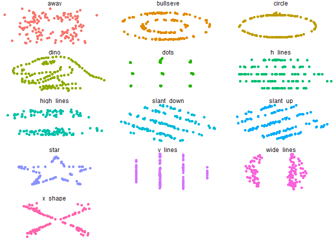
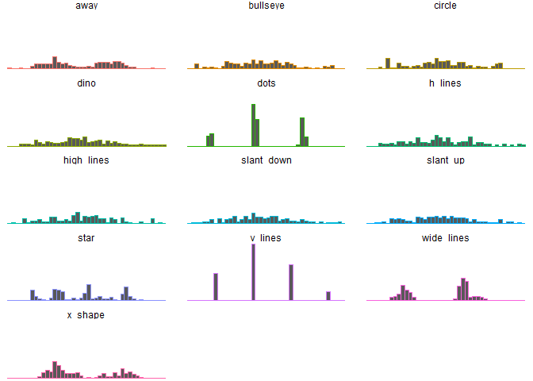
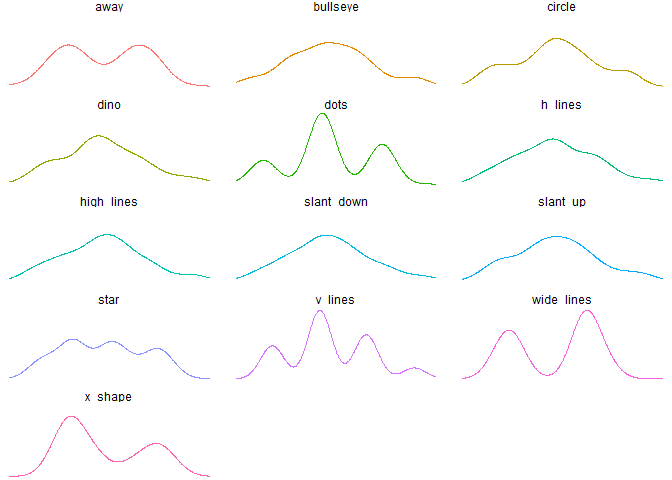
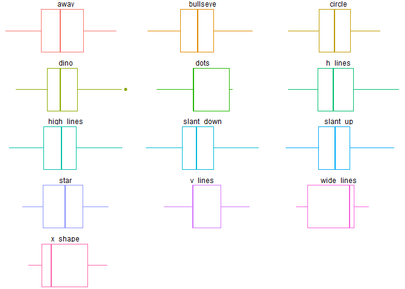
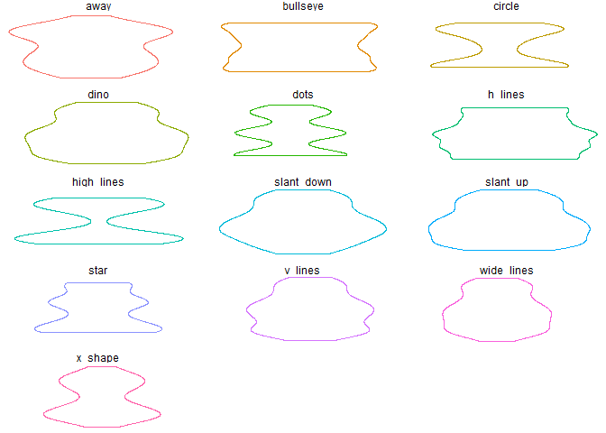
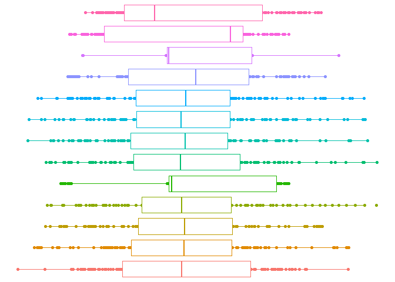

Clase 3: Exploración de datos
================

Análisis del conjunto de datos para resumir sus principales
características, mediante métodos estadísticos y visuales.

Objetivos:

  - Descubrir la estructura subyacente de los datos.

  - Identificar variables relevantes.

  - Detectar valores atípicos y anomalías.

  - Validar supuestos.

  - Generar hipótesis a partir de los datos.

## Analisis Exploratorio de Datos (EDA)

Vamos a explorar un conjunto de datos llamado datasauRus, que consiste
en la combinación de 13 sets de datos con coordenadas x e y

``` r
library(tidyverse)
library(datasauRus)
library(proxy)

summary(datasaurus_dozen)
```

    ##    dataset                x               y           
    ##  Length:1846        Min.   :15.56   Min.   : 0.01512  
    ##  Class :character   1st Qu.:41.07   1st Qu.:22.56107  
    ##  Mode  :character   Median :52.59   Median :47.59445  
    ##                     Mean   :54.27   Mean   :47.83510  
    ##                     3rd Qu.:67.28   3rd Qu.:71.81078  
    ##                     Max.   :98.29   Max.   :99.69468

``` r
stats <- datasaurus_dozen %>% 
            group_by(dataset) %>% 
            summarize(
              mean_x    = mean(x),
              mean_y    = mean(y),
              std_dev_x = sd(x),
              std_dev_y = sd(y),
              corr_pears  = cor(x, y, method = "pearson"),
              corr_spear  = cor(x, y, method = "spearman"),
              corr_kendall  = cor(x, y, method = "kendall"),
              simil_cos = simil(list(x,y), method = "cosine") %>% as.numeric(),   # funcion simil en la libreria proxy
              simil_jac = simil(list(x,y), method = "Jaccard") %>% as.numeric(),   # funcion simil en la libreria proxy
              simil_sm = simil(list(x,y), method = "simple matching") %>% as.numeric(),   # funcion simil en la libreria proxy
              simil_kul = simil(list(x,y), method = "Kulczynski1") %>% as.numeric(),   # funcion simil en la libreria proxy
              dist_euc = dist(list(x,y), method = "Euclidean") %>% as.numeric(),   
              dist_manh = dist(list(x,y), method = "Manhattan") %>% as.numeric(),  
              dist_sup = dist(list(x,y), method = "supremum") %>% as.numeric(),   
              median_x    = median(x),
              median_y    = median(y),
              CV_x = sd(x) / mean(x),
              CV_y = sd(y) / mean(y),
              max_x = max(x),
              max_y = max(y)
            )

stats %>% glimpse()
```

    ## Rows: 13
    ## Columns: 21
    ## $ dataset      <chr> "away", "bullseye", "circle", "dino", "dots", "h_lines...
    ## $ mean_x       <dbl> 54.26610, 54.26873, 54.26732, 54.26327, 54.26030, 54.2...
    ## $ mean_y       <dbl> 47.83472, 47.83082, 47.83772, 47.83225, 47.83983, 47.8...
    ## $ std_dev_x    <dbl> 16.76982, 16.76924, 16.76001, 16.76514, 16.76774, 16.7...
    ## $ std_dev_y    <dbl> 26.93974, 26.93573, 26.93004, 26.93540, 26.93019, 26.9...
    ## $ corr_pears   <dbl> -0.06412835, -0.06858639, -0.06834336, -0.06447185, -0...
    ## $ corr_spear   <dbl> -0.057299907, -0.078733673, -0.077291902, -0.065109041...
    ## $ corr_kendall <dbl> -0.034861652, -0.051842973, -0.017280991, -0.048312576...
    ## $ simil_cos    <dbl> 0.8242028, 0.8235815, 0.8237326, 0.8241943, 0.8248448,...
    ## $ simil_jac    <dbl> 1, 1, 1, 1, 1, 1, 1, 1, 1, 1, 1, 1, 1
    ## $ simil_sm     <dbl> 1, 1, 1, 1, 1, 1, 1, 1, 1, 1, 1, 1, 1
    ## $ simil_kul    <dbl> Inf, Inf, Inf, Inf, Inf, Inf, Inf, Inf, Inf, Inf, Inf,...
    ## $ dist_euc     <dbl> 395.0028, 395.6921, 395.5156, 394.9830, 394.2572, 394....
    ## $ dist_manh    <dbl> 3953.111, 4089.921, 4365.384, 3977.821, 3968.419, 3958...
    ## $ dist_sup     <dbl> 80.90001, 60.36668, 50.94506, 67.56410, 59.55409, 67.6...
    ## $ median_x     <dbl> 53.34030, 53.84209, 54.02321, 53.33330, 50.97677, 53.0...
    ## $ median_y     <dbl> 47.53527, 47.38294, 51.02502, 46.02560, 51.29929, 50.4...
    ## $ CV_x         <dbl> 0.3090295, 0.3090037, 0.3088417, 0.3089593, 0.3090240,...
    ## $ CV_y         <dbl> 0.5631839, 0.5631458, 0.5629457, 0.5631222, 0.5629241,...
    ## $ max_x        <dbl> 91.63996, 91.73554, 85.66476, 98.20510, 77.95444, 98.2...
    ## $ max_y        <dbl> 97.47577, 85.87623, 85.57813, 99.48720, 94.24933, 90.4...

``` r
## los metodos de similaridad y distancias disponibles en el paquete proxy
summary(pr_DB)
```

    ## * Similarity measures:
    ## Braun-Blanquet, Chi-squared, correlation, cosine, Cramer, Dice, eDice,
    ## eJaccard, Fager, Faith, Gower, Hamman, Jaccard, Kulczynski1,
    ## Kulczynski2, Michael, Mountford, Mozley, Ochiai, Pearson, Phi,
    ## Phi-squared, Russel, simple matching, Simpson, Stiles, Tanimoto,
    ## Tschuprow, Yule, Yule2
    ## 
    ## * Distance measures:
    ## Bhjattacharyya, Bray, Canberra, Chord, divergence, Euclidean, fJaccard,
    ## Geodesic, Hellinger, Kullback, Levenshtein, Mahalanobis, Manhattan,
    ## Minkowski, Podani, Soergel, supremum, Wave, Whittaker

## Visualizacion de datos

La gramatica de graficos (grammar of graphics o gg) propone crear
diagramas apilando una capa sobre otra.

Esta gramática está implementada en la libreria de R llamada ggplot2

``` r
ggplot(datasaurus_dozen, aes(x=x, y=y, colour=dataset)) + # la primera linea define los parametros del grafico, la data, coordenadas y color
    geom_point() +                                        # en esta linea se define la geometria de la figura, en este caso un punto
    theme_void() +                                        # aca definimos el tema del grafico
    theme(legend.position = "none") +                     # quitamos la leyenda 
    facet_wrap(~dataset, ncol=3)                          # creamos un subgrafico por cada dataset  
```

<!-- -->

``` r
ggplot(datasaurus_dozen, aes(x=x,colour=dataset))+
    geom_histogram(binwidth = 2)+                         # cambio la geometria
    theme_void()+
    theme(legend.position = "none")+
    facet_wrap(~dataset, ncol=3)
```

<!-- -->

``` r
ggplot(datasaurus_dozen, aes(x=x,colour=dataset))+
    geom_density()+
    theme_void()+
    theme(legend.position = "none")+
    facet_wrap(~dataset, ncol=3)
```

<!-- -->

``` r
ggplot(datasaurus_dozen, aes(x=x, colour=dataset))+
    geom_boxplot()+
    theme_void()+
    theme(legend.position = "none")+
    facet_wrap(~dataset, ncol=3)
```

<!-- -->

``` r
ggplot(datasaurus_dozen, aes(x=x, y=y, colour=dataset))+
    geom_violin()+
    theme_void()+
    theme(legend.position = "none")+
    facet_wrap(~dataset, ncol=3)
```

<!-- -->

``` r
# y podemos combinar geometrias entre si
ggplot(datasaurus_dozen, aes(x=x, y=dataset, colour=dataset)) +
    geom_point() +
    geom_boxplot() +
    theme_void() +
    theme(legend.position = "none")
```

<!-- -->
