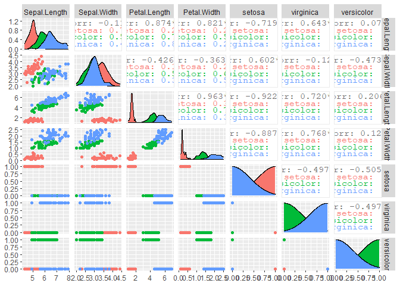
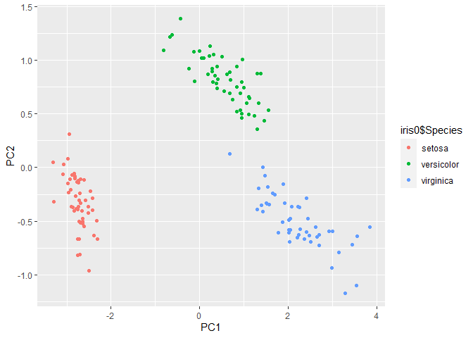
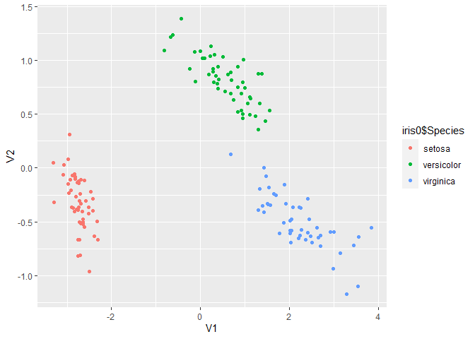
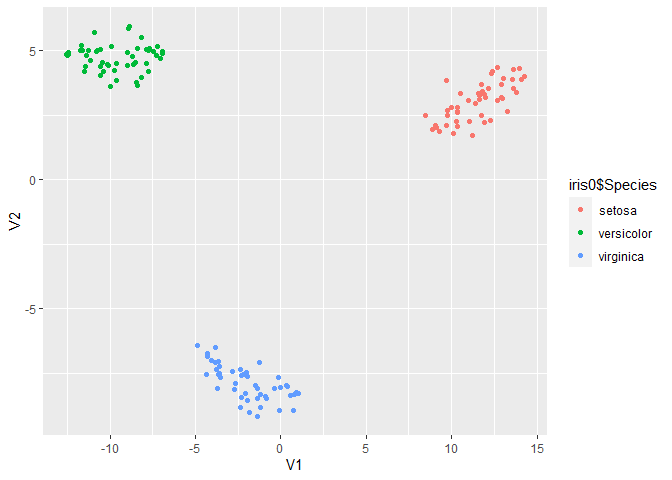

Clase 4: Ingenieria de atributos
================

La ingenieria de atributos consiste en generar el listado de atributos
que se utilizaran en el analisis de datos, a partir del conjunto de
atributos originales.

Este proceso puede hacerse manualmente o algoritmicamente, y se puede
enfocar de dos maneras: Seleccion de atributos o Extraccion de atributos

## Selección de atributos

Para probar los diferentes metodos para seleccionar atributos
utilizaremos el dataset iris, que viene en R base

``` r
iris0 <- iris %>% unique()

str(iris0)
```

    ## 'data.frame':    149 obs. of  5 variables:
    ##  $ Sepal.Length: num  5.1 4.9 4.7 4.6 5 5.4 4.6 5 4.4 4.9 ...
    ##  $ Sepal.Width : num  3.5 3 3.2 3.1 3.6 3.9 3.4 3.4 2.9 3.1 ...
    ##  $ Petal.Length: num  1.4 1.4 1.3 1.5 1.4 1.7 1.4 1.5 1.4 1.5 ...
    ##  $ Petal.Width : num  0.2 0.2 0.2 0.2 0.2 0.4 0.3 0.2 0.2 0.1 ...
    ##  $ Species     : Factor w/ 3 levels "setosa","versicolor",..: 1 1 1 1 1 1 1 1 1 1 ...

``` r
# debemos transformar variable Species en numerica, lo hacemos creando variables dummy
iris0$setosa <- ifelse(iris0$Species == "setosa", 1, 0)
iris0$virginica <- ifelse(iris0$Species == "virginica", 1, 0)
iris0$versicolor <- ifelse(iris0$Species == "versicolor", 1, 0)

iris_num <- iris0 # creamos una copia de la data pero con varibles numericas solamente
iris_num$Species <- NULL


## primero probaremos el algoritmo de fuerza bruta
library(stuart) 
```

    ## Warning: This is a beta-build of stuart. Please report any bugs you encounter.

``` r
results <- bruteforce(iris_num, list(ra = names(iris_num)), 3,
  cores = 4)  # numero de nucleos en la maquina
```

    ## Loading required namespace: lavaan

    ## Loading required namespace: parallel

    ## There are 35 combinations that need to be tested.

    ## Generating all possible combinations.

    ## Running STUART with Brute-Force.

    ##   |                                                                              |                                                                      |   0%

    ## Progressbars are not functional when utilizing multiple cores for bruteforce in Windows.

    ## 
    ## Search ended.

``` r
summary(results)  
```

    ## Warning: This is a beta-build of stuart. Please report any bugs you encounter.

    ## SUMMARY OF ANALYSIS:
    ## 
    ## Analysis Type: bruteforce 
    ## Estimation Software: lavaan 
    ## Models estimated: 35 
    ## Replications of final solution: 1 
    ## Time Required: 75.13 seconds
    ## 
    ## Optimization History:
    ##   run pheromone chisq df pvalue rmsea         srmr      crel
    ## 1   1  0.000000    NA NA     NA    NA           NA        NA
    ## 4   4  1.581531     0  0     NA     0 7.713060e-09 0.6347924
    ## 8   8  1.969105     0  0     NA     0 1.846159e-09 0.9611068
    ## 
    ## Constructed Subtests:
    ## ra: Sepal.Length Petal.Length virginica

``` r
## para el resto de los metodos utilizamos la siguiente libreria
library(FSinR)   # feature selection

# Para usarla, primero debemos utilizar un metodo de optimizacion, donde todas las opciones disponibles estan en
 ? searchAlgorithm
```

    ## starting httpd help server ...

    ##  done

``` r
# Estos algoritmos buscaran el optimo en todo el espacio de soluciones
searcher <- searchAlgorithm('geneticAlgorithm')
searcher <- searchAlgorithm('tabu', list(tamTabuList = 4, iter = 5, intensification=2, iterIntensification=5, diversification=1, iterDiversification=5, verbose=FALSE) )
searcher <- searchAlgorithm('antColony')
searcher <- searchAlgorithm('sequentialForwardSelection')
searcher <- searchAlgorithm('hillClimbing')


## Luego tenemos que definir una variable para filtrar, las variables disponibles estan en 
? filterEvaluator

filtro <- filterEvaluator("IEConsistency")
filtro <- filterEvaluator('determinationCoefficient')
filtro <- filterEvaluator('chiSquared')
filtro <- filterEvaluator('MDLC') 


## finalmente optimizamos los atributos, utilizando la variable Species como referencia para pronosticar
results <- featureSelection(iris0, 'Species', searcher, filtro)

results$bestFeatures
```

    ##      Sepal.Length Sepal.Width Petal.Length Petal.Width setosa virginica
    ## [1,]            0           0            0           0      1         0
    ##      versicolor
    ## [1,]          0

``` r
## tambien se puede pronosticar la variable de referencia utilizando una funcion de envoltorio o wrapper. las funciones disponibles se pueden ver en 
? wrapperEvaluator

evaluator <- wrapperEvaluator("xgbLinear")
evaluator <- wrapperEvaluator("svmLinearWeights")
evaluator <- wrapperEvaluator("mlpWeightDecay")
evaluator <- wrapperEvaluator("lm")
evaluator <- wrapperEvaluator("knn")

results <- featureSelection(iris0, 'Species', searcher, evaluator)
```

    ## Loading required package: lattice

    ## 
    ## Attaching package: 'caret'

    ## The following object is masked from 'package:purrr':
    ## 
    ##     lift

``` r
results$bestFeatures
```

    ##      Sepal.Length Sepal.Width Petal.Length Petal.Width setosa virginica
    ## [1,]            0           0            0           0      1         0
    ##      versicolor
    ## [1,]          1

``` r
## por ultimo tambien se pueden seleccionar atributos por busquedas directas

directSearcher <- directSearchAlgorithm('selectKBest', list(k=3))

## ojo que la funcion es diferente a la anterior
results <- directFeatureSelection(iris0, 'Species', directSearcher, evaluator)

results$bestFeatures
```

    ##      Sepal.Length Sepal.Width Petal.Length Petal.Width setosa virginica
    ## [1,]            1           0            1           1      0         0
    ##      versicolor
    ## [1,]          0

Ahora vamos a visualizar todos los pares de variables originales, a ver
si se pueden ver patrones claros

``` r
library(GGally)

ggpairs(iris_num, aes(col=iris0$Species))
```

<!-- -->

## Extracción de atributos

Para la extraccion de atributos probaremos diferentes metodologias sobre
la misma data

``` r
#PCA
PCA <- prcomp(iris_num)

barplot(PCA$sdev)
```

<!-- -->

``` r
predict(PCA) %>% as.data.frame() %>%  ggplot(aes(PC1,PC2, col=iris0$Species)) + geom_point()
```

<!-- -->

``` r
#MDS

d <- dist(iris_num) # distancias euclidianas entre entidades
MDS <- cmdscale(d,eig=TRUE, k=2) # k es el numero de dimensiones de salida

MDS$points %>% as.data.frame() %>% ggplot(aes(V1,V2, col=iris0$Species)) + geom_point()
```

<!-- -->

``` r
#nMDS


library(MASS)
```

    ## 
    ## Attaching package: 'MASS'

    ## The following object is masked from 'package:dplyr':
    ## 
    ##     select

``` r
nMDS <- isoMDS(d, k=2) 
```

    ## initial  value 4.703287 
    ## iter   5 value 3.585754
    ## iter  10 value 3.340021
    ## final  value 3.313648 
    ## converged

``` r
nMDS$points %>% as.data.frame() %>% ggplot(aes(V1,V2, col=iris0$Species)) + geom_point()
```

<!-- -->

``` r
#tSNE

library(Rtsne)
```

    ## Warning: package 'Rtsne' was built under R version 4.0.4

``` r
tsne <- Rtsne(iris_num, dims = 2, perplexity=30, verbose=TRUE, max_iter = 500)
```

    ## Performing PCA
    ## Read the 149 x 7 data matrix successfully!
    ## OpenMP is working. 1 threads.
    ## Using no_dims = 2, perplexity = 30.000000, and theta = 0.500000
    ## Computing input similarities...
    ## Building tree...
    ## Done in 0.03 seconds (sparsity = 0.710058)!
    ## Learning embedding...
    ## Iteration 50: error is 41.507991 (50 iterations in 0.03 seconds)
    ## Iteration 100: error is 42.282248 (50 iterations in 0.02 seconds)
    ## Iteration 150: error is 43.011525 (50 iterations in 0.06 seconds)
    ## Iteration 200: error is 40.987996 (50 iterations in 0.03 seconds)
    ## Iteration 250: error is 41.171334 (50 iterations in 0.04 seconds)
    ## Iteration 300: error is 0.272323 (50 iterations in 0.03 seconds)
    ## Iteration 350: error is 0.070214 (50 iterations in 0.03 seconds)
    ## Iteration 400: error is 0.066730 (50 iterations in 0.03 seconds)
    ## Iteration 450: error is 0.064932 (50 iterations in 0.07 seconds)
    ## Iteration 500: error is 0.059975 (50 iterations in 0.05 seconds)
    ## Fitting performed in 0.39 seconds.

``` r
tsne$Y %>% as.data.frame() %>% ggplot(aes(V1,V2, col=iris0$Species)) + geom_point()
```

<!-- -->
