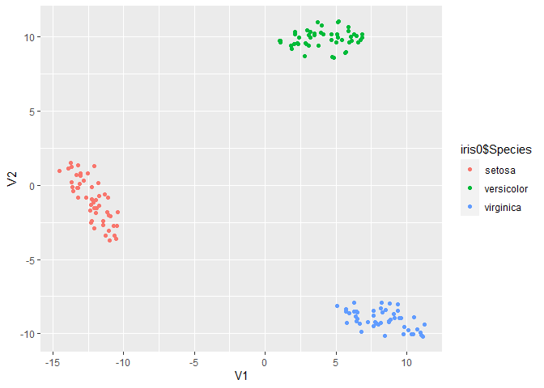

Clase 4: Ingenieria de atributos
================

La ingenieria de atributos consiste en generar el listado de atributos
que se utilizaran en el analisis de datos, a partir del conjunto de
atributos originales.

Este proceso puede hacerse manualmente o algoritmicamente, y se puede
enfocar de dos maneras: Seleccion de atributos o Extraccion de atributos

## Selección de atributos

Para probar los diferentes metodos para seleccionar atributos
utilizaremos el dataset iris, que viene en R base

``` r
iris0 <- iris %>% unique()

str(iris0)
```

    ## 'data.frame':    149 obs. of  5 variables:
    ##  $ Sepal.Length: num  5.1 4.9 4.7 4.6 5 5.4 4.6 5 4.4 4.9 ...
    ##  $ Sepal.Width : num  3.5 3 3.2 3.1 3.6 3.9 3.4 3.4 2.9 3.1 ...
    ##  $ Petal.Length: num  1.4 1.4 1.3 1.5 1.4 1.7 1.4 1.5 1.4 1.5 ...
    ##  $ Petal.Width : num  0.2 0.2 0.2 0.2 0.2 0.4 0.3 0.2 0.2 0.1 ...
    ##  $ Species     : Factor w/ 3 levels "setosa","versicolor",..: 1 1 1 1 1 1 1 1 1 1 ...

``` r
# debemos transformar variable Species en numerica, lo hacemos creando variables dummy
iris0$setosa <- ifelse(iris0$Species == "setosa", 1, 0)
iris0$virginica <- ifelse(iris0$Species == "virginica", 1, 0)
iris0$versicolor <- ifelse(iris0$Species == "versicolor", 1, 0)

iris_num <- iris0 # creamos una copia de la data pero con varibles numericas solamente
iris_num$Species <- NULL
```

Primero probaremos el algoritmo de fuerza bruta

``` r
library(stuart) 

results <- bruteforce(iris_num, list(ra = names(iris_num)), 3,
  cores = 1)  # numero de nucleos en la maquina
```

    ##   |                                                                              |                                                                      |   0%  |                                                                              |==                                                                    |   3%  |                                                                              |====                                                                  |   6%  |                                                                              |======                                                                |   9%  |                                                                              |========                                                              |  11%  |                                                                              |==========                                                            |  14%  |                                                                              |============                                                          |  17%  |                                                                              |==============                                                        |  20%  |                                                                              |================                                                      |  23%  |                                                                              |==================                                                    |  26%  |                                                                              |====================                                                  |  29%  |                                                                              |======================                                                |  31%  |                                                                              |========================                                              |  34%  |                                                                              |==========================                                            |  37%  |                                                                              |============================                                          |  40%  |                                                                              |==============================                                        |  43%  |                                                                              |================================                                      |  46%  |                                                                              |==================================                                    |  49%  |                                                                              |====================================                                  |  51%  |                                                                              |======================================                                |  54%  |                                                                              |========================================                              |  57%  |                                                                              |==========================================                            |  60%  |                                                                              |============================================                          |  63%  |                                                                              |==============================================                        |  66%  |                                                                              |================================================                      |  69%  |                                                                              |==================================================                    |  71%  |                                                                              |====================================================                  |  74%  |                                                                              |======================================================                |  77%  |                                                                              |========================================================              |  80%  |                                                                              |==========================================================            |  83%  |                                                                              |============================================================          |  86%  |                                                                              |==============================================================        |  89%  |                                                                              |================================================================      |  91%  |                                                                              |==================================================================    |  94%  |                                                                              |====================================================================  |  97%  |                                                                              |======================================================================| 100%

``` r
summary(results)  
```

    ## SUMMARY OF ANALYSIS:
    ## 
    ## Analysis Type: bruteforce 
    ## Estimation Software: lavaan 
    ## Models estimated: 35 
    ## Replications of final solution: 1 
    ## Time Required: 62.44 seconds
    ## 
    ## Optimization History:
    ##   run pheromone chisq df pvalue rmsea         srmr      crel
    ## 1   1  0.000000    NA NA     NA    NA           NA        NA
    ## 4   4  1.581531     0  0     NA     0 7.713060e-09 0.6347924
    ## 8   8  1.969105     0  0     NA     0 1.846159e-09 0.9611068
    ## 
    ## Constructed Subtests:
    ## ra: Sepal.Length Petal.Length virginica

Para el resto de los metodos utilizamos la libreria FSinR (Feature
Selection in R)

Para usarla, primero debemos utilizar un metodo de optimizacion, donde
todas las opciones disponibles estan en ? searchAlgorithm

Estos algoritmos buscaran el optimo en todo el espacio de soluciones

``` r
library(FSinR)   # feature selection


searcher <- searchAlgorithm('geneticAlgorithm')
searcher <- searchAlgorithm('tabu', list(tamTabuList = 4, iter = 5, intensification=2, iterIntensification=5, diversification=1, iterDiversification=5, verbose=FALSE) )
searcher <- searchAlgorithm('antColony')
searcher <- searchAlgorithm('sequentialForwardSelection')
searcher <- searchAlgorithm('hillClimbing')
```

Luego tenemos que definir una variable para filtrar, las variables
disponibles estan en ? filterEvaluator

``` r
filtro <- filterEvaluator("IEConsistency")
filtro <- filterEvaluator('determinationCoefficient')
filtro <- filterEvaluator('chiSquared')
filtro <- filterEvaluator('MDLC') 
```

Finalmente optimizamos los atributos, utilizando la variable Species
como referencia para pronosticar

``` r
results <- featureSelection(iris0, 'Species', searcher, filtro)

results$bestFeatures
```

    ##      Sepal.Length Sepal.Width Petal.Length Petal.Width setosa virginica
    ## [1,]            0           0            0           0      1         0
    ##      versicolor
    ## [1,]          0

Tambien se puede pronosticar la variable de referencia utilizando una
funcion de envoltorio o wrapper. Las funciones disponibles se pueden ver
en ? wrapperEvaluator

``` r
evaluator <- wrapperEvaluator("xgbLinear")
evaluator <- wrapperEvaluator("svmLinearWeights")
evaluator <- wrapperEvaluator("mlpWeightDecay")
evaluator <- wrapperEvaluator("lm")
evaluator <- wrapperEvaluator("knn")

results <- featureSelection(iris0, 'Species', searcher, evaluator)

results$bestFeatures
```

    ##      Sepal.Length Sepal.Width Petal.Length Petal.Width setosa virginica
    ## [1,]            0           0            0           1      0         0
    ##      versicolor
    ## [1,]          1

Por ultimo tambien se pueden seleccionar atributos por busquedas
directas.

Ojo que la funcion FeatureSelection es diferente a la anterior

``` r
directSearcher <- directSearchAlgorithm('selectKBest', list(k=3))

results <- directFeatureSelection(iris0, 'Species', directSearcher, evaluator)

results$bestFeatures
```

    ##      Sepal.Length Sepal.Width Petal.Length Petal.Width setosa virginica
    ## [1,]            1           0            1           1      0         0
    ##      versicolor
    ## [1,]          0

Ahora vamos a visualizar todos los pares de variables originales, a ver
si se pueden ver patrones claros

``` r
library(GGally)

ggpairs(iris_num, aes(col=iris0$Species))
```

<!-- -->

## Extracción de atributos

Para la extraccion de atributos probaremos diferentes metodologias sobre
la misma data. En todos los casos graficaremos los datos sobre los
nuevos atributos, para ver si se diferencian mejor que con los atributos
originales.

Primero comenzamos con componentes principales (PCA)

``` r
#PCA
PCA <- prcomp(iris_num)

barplot(PCA$sdev) ## graficamos el aporte de varianza de cada componente principal
```

<!-- -->

``` r
predict(PCA) %>% as.data.frame() %>%  ggplot(aes(PC1,PC2, col=iris0$Species)) + geom_point()
```

<!-- -->

Luego escalamiento multidimensional (MDS)

``` r
#MDS
d <- dist(iris_num) # distancias euclidianas entre entidades
MDS <- cmdscale(d,eig=TRUE, k=2) # k es el numero de dimensiones de salida

MDS$points %>% as.data.frame() %>% ggplot(aes(V1,V2, col=iris0$Species)) + geom_point()
```

<!-- -->

Escalamiento multidimensional no parametrico (n-MDS)

``` r
#nMDS
library(MASS)
nMDS <- isoMDS(d, k=2) 
```

    ## initial  value 4.703287 
    ## iter   5 value 3.585754
    ## iter  10 value 3.340021
    ## final  value 3.313648 
    ## converged

``` r
nMDS$points %>% as.data.frame() %>% ggplot(aes(V1,V2, col=iris0$Species)) + geom_point()
```

<!-- -->

t-distributed stochastic neighbor embedding

``` r
#tSNE

library(Rtsne)
tsne <- Rtsne(iris_num, dims = 2, perplexity=30, max_iter = 500)

tsne$Y %>% as.data.frame() %>% ggplot(aes(V1,V2, col=iris0$Species)) + geom_point()
```

<!-- -->
